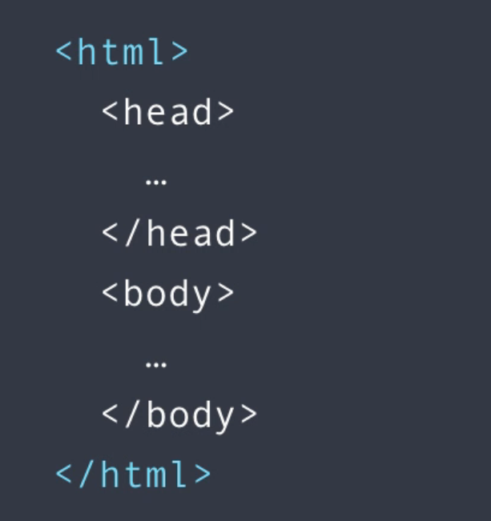

# Angular 4

```sbtshell
$ sudo npm uninstall -g @angular/cli
$ ng new hello-world
$ ng serve

$ ls ~/src/app/app.component.ts
```

### Webpack :

It is the compilation engine that generates the bundles with all the js, css, etc... These bundles are minified and optimized.
The references to these files are injected into HTML page :

	<script src="runtime.js" defer></script>
	<script src="polyfills.js" defer></script>
	<script src="vendor.js" defer></script>
	<script src="main.js" defer></script>


### TypeScript :

It is like a super Javascript code. Every valid Javascript code is a valid TypeScript code. But it has some extra features that Javascript does not have.

Strong typing : it is not mandatory but it is better to type variables.

Object-oriented features : classes, interfaces, constructors, access modifiers, generics, etc.
Compile-time errors.

Browsers do not understand TypeScript, so it is transpiled to Javascript.
```sbtshell
$ sudo npm install -g typescript
$ tsc main.ts 

```
It generates the Javascript file main.js

##### To declare variables :

1. **var** : to declare a global variable in Javascript : It is scoped to the nearest function.
2. **let** : to declare a local variable associated to the nearest block. Example : 
```java
let a: number;
```

Other types are boolean, string, any, number[], enum.

##### Type assertion :
It does not change the type of the variable, only tells the compiler about its type
```java
let endsWithC = (<string> message).endsWith('c');
console.log(endsWithC);

endsWithC = (message as string).endsWith('b');
console.log(endsWithC);
```

- Arrow function : like lambda
```java
let doLog = (message) => {
    console.log(message);
}
```

One line in the function : no need to use the curly braces :
```java
let anotherDoLog = (message) => console.log(message);
```

##### Interfaces : 
```java
interface Point {
	x: number,
	y: number,
	draw: () => void // Que des declarations dans les interfaces
}
```

For Javascript it is :
```java
let oneMoreDrawPoint = (point: { x:number, y:number }) => {
	// Expecting x and y
	console.log(point.x + '-' + point.y);
};
```

##### Classes :
In TypeScript it is not possible to have multiple constructors, so the solution is to declare constructor parameters optionel :
```java
constructor(x?: number, y?: number)
```

Access modifiers are : 
- public.
- private.
- protected.

By default all members are public.

Example of class declaration :

As params has an access modifier, we consider them as attributes of the class. We prefix by _ to avoid confusion with the getter and setter methods.

Commented code is not needed.
```java
	/* private x: number;
	private y: number; */

	constructor(private _x?: number, private _y?: number) {
		/* this.x = x;
		this.y = y; */
	}
```

How to access getters and setters like properties (for that reason rename properties to _x and _y) :
```java
	get x() {
		return this._x;
	}

	set x(value: number) {
		if (value < 0)
			throw new Error('Value cannot be less than 0.');

		this._x = value;
	}
```

##### Modules :
We can think of each file as a module. To allow a class to be used from the outside use the keyword 'export'.

And to import them use the keyword 'import'. Example : 
```java
import { Point } from './point'.
```

### Angular Fundamentals :

- **Components** : It encapsulates the data, the HTML template and the logic for a view.


Components can be reused in different ways in a same application.
So Angular is a components-based architecture. It allows the developer to work on smaller and more maintanable pieces.

An Angular App is a tree of components :


1. Create a component.

    To generate a component, it is also related to a module :
    
    ```sbtshell$ ng g c course```

2. Register it to a module.
3. Add an element in an HTML markup.

- **Modules** :
A module is a container for a group of related components.
Every Angular application has at least one module, called app module.

For example, Udemy website can be splited like this :


Warning : Components should not contain any logic other than presentation logic.

- **Template** :
We can use a template or a templateUrl that point on an html file.
In the templates we can use data binding with {{ }} :
```html
    template: '<h2>{{ title }}</h2>'
```

Instead of a variable it is possible to put any javascript code.

- **Directives** :
They are used for DOM manipulation : manipulate elements, classes, etc.

- **Services** :
They are used encapsulate the logic for calling end points on the backend and process the result.
To be able to use a service in a component we need dependency injection.
Angular has a dependency injection framework built into it. So when it is going to create an instance of a component, it can inject dependencies.

```java
    export class CoursesComponent {
	    constructor(service: CoursesService) {
            ...
```
 
And the service must be declared as a provider in the application module.

When a dependency is registered as a provider, Angular will create a single instance of that class or module (Singleton pattern).
```java
    @NgModule({
        providers: [
            CoursesService
        ]
    ...
```

To create a service with the angular cli :
```sbtshell
$ ng g s email
```

The generated service has an Injectable decorator which tells that this component can need the injection of a dependency (like LogService for example) :
```java
    @Injectable()
    export class EmailService {
        constructor(logService: LogService) { 
            ...
        }
```

Component decorator already contains the Injectable decorator so no need to add it for a component.

###  Display data :

##### Property binding :
```html
	template: ''
```
This is only one way binding from Angular to the DOM.

Angular engine will bind a property of the DOM element (like src here) to a field or a property of a component, so behind the scenes :

From string interpolation : 
```html

```
To :
```html
'
```

So whenever the value of the field changes, the source attributes of this image element is updated.

###### Concepts :
DOM is a model of objects that represents the structure of a document, basically a tree of objects in memory.


HTML is the representation of the DOM :



Most of the attributes of HTML elements have a one to one mapping to properties of DOM objects.
But there are a few exceptions.

For example colspan is only in HTML and textContent only in DOM.

So to bind an HTML attribute that does not exist in the DOM tell Angular that the target is an HTML attribute with the prefix `attr` :
```html
	<td [colspan]="attr.colSpan">Val 1</td>
```

##### Adding bootstrap :

Download bootstrap, stores it into node modules folder and adds bootstrap as a dependency in the package.json file :
```sbtshell
$ npm install bootstrap --save
```

To download and install all the dependencies :
```sbtshell
$ npm install
```

##### Class binding :

This will add `active` to the class of the element (class="active") if the value of the variable is true :
```html
	<button [class.active]="isActive">Save</button>
```

##### Style binding :

To find the list of style object properties : https://www.w3schools.com/jsref/dom_obj_style.asp
```html
	<button [style.backgroundColor]="isActive ? 'blue' : 'red'">Cancel</button>
```

##### Event binding :

How to handle event from the DOM, like keystroke, mouse movement, mouse clicks, etc. ?

For mouse click :
```html
	<button (click)="onSave()">Save</button>
```
To access to the event object raised in the event handler, for example the mouse movement to get the X and Y position :<br/>
Add the event as a parameter of the function called when the event occurs :
```html
	<button (click)="onSave($event)">Save</button>
```

**Event bubbling** :<br/>
All the DOM events bubble up the DOM tree unless a handler along the way prevents further bubbling. This is the standard event propagation mechanism in DOM.<br/>
For the following component both methods will be called when a click occurs on the button :
```html
	<div (click)="onDivClicked()">
		<button (click)="onSave($event)">Save</button>
	</div>
```

How to stop event bubbling ? Call the event stop propagation :
```java
	$event.stopPropagation();
```

##### Event filtering :
This is the fancy way :
```html
	<input (keyup.enter)="onKeyUp()"/>
```

The ugly way is to pass the event as a parameter and to test $event.keyCode in the method.

##### Template variables :

Hint : The event object has a target property that represents the DOM element that fired the event.
	console.log($event.target.value)

There is a better way to get the target value :
```html
	<input #email (keyup.enter)="onKeyUp(email.value)"/>
```

```java
	onKeyUp(emailValue: String) { ... }
```

##### Two-way binding :

Reminder : The component encapsulates the data, the logic and the HTML.
```java
	export class CoursesComponent {
		email;

		onKeyUp() {
			console.log("Key up on input with ENTER !", this.email);
		}
```
So here, the field email is used to encapsualte the data and the onKeyUp method represents the behavior or the logic behind this view.
```html
	<input [value]="email" (keyup.enter)="onKeyUp()"/>
```

Reminder :
- Property binding : the direction of binding is from the component to the view.


How to bind it from the view to the component ?

First option :
```html
	<input [value]="email" (keyup.enter)="email = $event.target.value; onKeyUp()"/>
```

Better option :
```html
	<input [(ngModel)]="email" (keyup.enter)="onKeyUp()"/>
```

What is ngModel ? It is a directive used for implementing two-way binding.<br/>
Although ngModel is a valid Angular directive, it is not available by default. It is defined in the module called forms.

Documentation : 

[Two Way Binding Documentation Link Here](https://angular.io/tutorial/toh-pt1#!#two-way-binding)

Another directive example : ngFor is a directive used to manipulate the DOM.