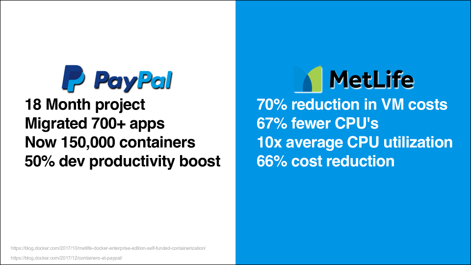
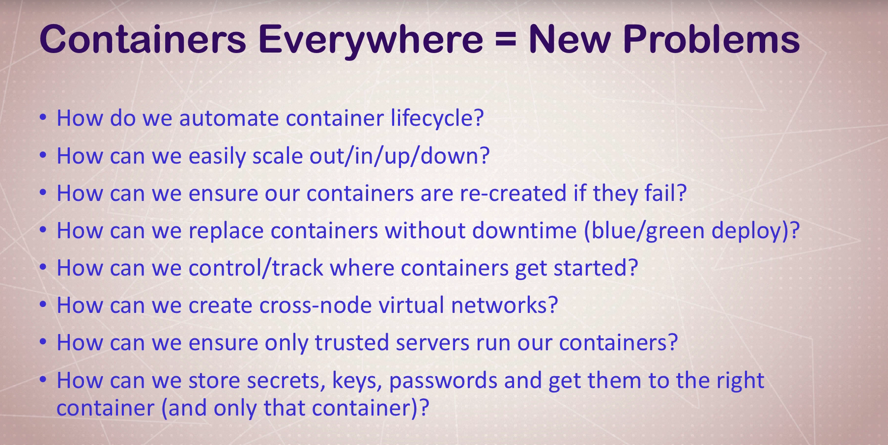
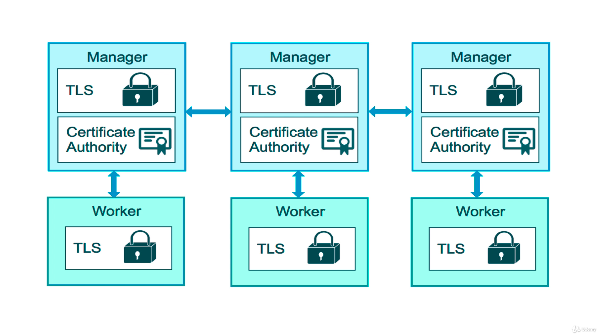
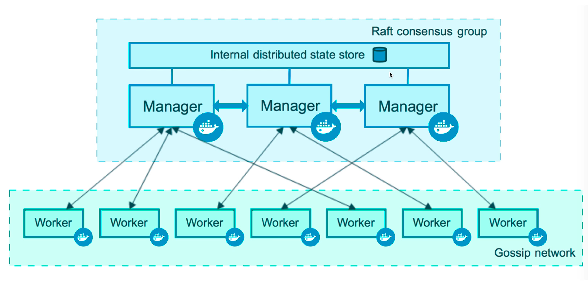
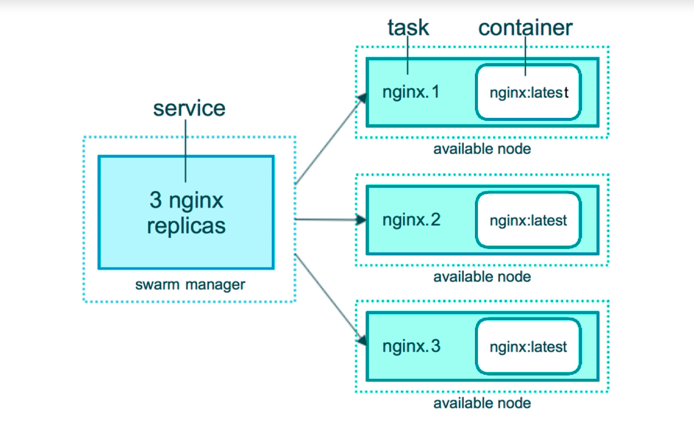
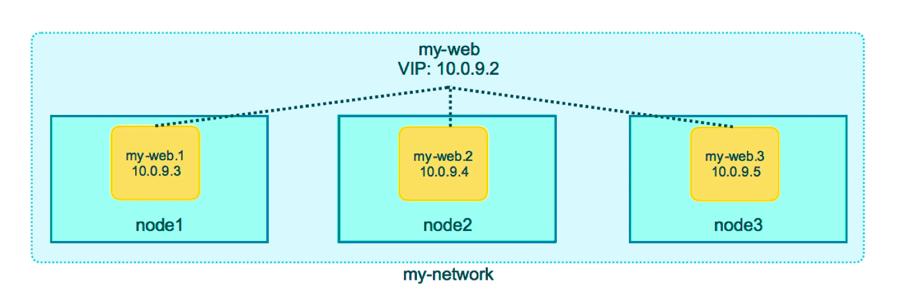
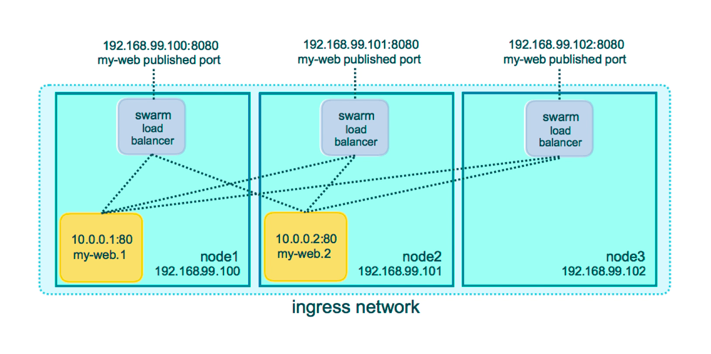
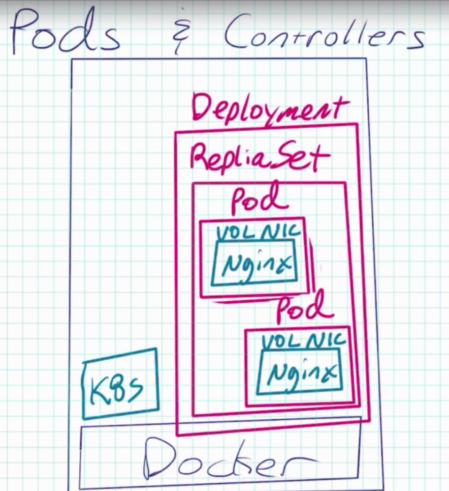

# DOCKER COURSE

<p align="center">
  
</p>

### Major infrastructure shifts :
Mainframe to PC : 90's
Baremetal to Virtual : 00's
Datacenter to Cloud : 10's
Host to Container : (Serverless) ...

Docker is all about speed.
Build faster, test faster, deploy faster, update faster, recover faster.

Allows :
- to package the same way regardless of the operating system.
- to distribute the software regardless of the setup.
- to run and test the software the same way everywhere.

Docker frees a lot of maintenance tasks.

**Two editions :** The Community Edition (free) Vs. The Enterprise Edition (paid).<br/>
Enterprise Edition includes support and extra products. It is certified on specific platforms.

RHEL officially only supports the Docker EE.

Edge means beta in Docker world.
It gets new features first, but only supported for a month.



## Linux install :

To get the latest Edge release (better for testing) :
```console
$ curl -fsSL https://get.docker.com -o get-docker.sh
$ sh get-docker.sh
```

**WARN :** This is not recommended for security because it allows this user to perform actions that are only allowed for root user.<br/>
To use Docker as a non-root user, you should now consider adding your user to the "docker" group with something like :
```console
$ sudo usermod -aG docker mcheghal

$ sudo systemctl enable docker
$ sudo systemctl start docker

$ sudo docker version
```

Install Docker Machine :
```console
$ base=https://github.com/docker/machine/releases/download/v0.16.0 &&
curl -L $base/docker-machine-$(uname -s)-$(uname -m) >/tmp/docker-machine &&
sudo mv /tmp/docker-machine /usr/local/bin/docker-machine &&
chmod +x /usr/local/bin/docker-machine

$ docker-machine version
```

Install Docker Compose :
```console
$ sudo curl -L "https://github.com/docker/compose/releases/download/1.25.4/docker-compose-$(uname -s)-$(uname -m)" -o /usr/local/bin/docker-compose
$ sudo chmod +x /usr/local/bin/docker-compose

$ docker-compose version
```

## Docker :

Containers are the fundamental building block of the Docker toolkit.
```console
$ sudo docker info
```

Docker command line structure :
- Old : docker <command> (options)
- New : docker <command> <sub-command> (options)

For example : From "docker run" To "docker container run".

### Image Vs. Container

An image is the application we want to run : The binaries, libraries and source code that all make up an application.
The container is a running instance of that image running as a process.

Registries are where docker images are stored. The default one for Docker is Docker Hub.

### Playing with containers :

Start a new container from an image :
```console
$ docker container run --publish 80:80 nginx
```

1. Downloads image 'nginx' from Docker Hub.
* Looks for the image locally in image cache.
* If not found, it looks in remote image repository (default to Docker Hub). 
* Downloads the latest version of the image (it is possible to specify a version).

2. Creates a new container based on the image and prepares to start.

3. Gives it a virtual IP on a private network inside Docker engine.

4. The "publish" command with the value "80:80" tells to take the port 80 on the host and forward all that traffic to port 80 in the container. 
It exposes local port 80 on the local machine.

5. Starts the container by using a command specified in the image Dockerfile.

Detach tells Docker to run it in the background.
```console
$ sudo docker container run --publish 80:80 --detach nginx
```
Lists all the running containers. Add option -a to have the stopped containers too.
```console
$ sudo docker container ls (old way is docker ps)
```
To start again the previously stopped container.
```console
$ sudo docker container stop 4c60307e32ee
$ sudo docker container start 4c60307e32ee
```

To show logs for a specific container.
```console
$ sudo docker container logs busy_northcutt (old way is docker logs)
```

Option -f is used to remove the running containers.
```console
$ sudo docker container rm -f 974319dc07da 4c60307e32ee 428e9259c1e0
```

### Containers are just processes running on the host operating system.
If we type "ps aux" on the host we will see the process running inside the container. They are not hidden inside a virtual machine.

**Example :**

* Nginx :
```console
$ sudo docker container run --publish 80:80 --detach --name nginx nginx
```

* Apache :
```console
$ sudo docker container run -p 8080:80 --detach --name apache httpd
```

* MySQL :
```console
$ sudo docker container run -p 3306:3306  --env="MYSQL_RANDOM_ROOT_PASSWORD=yes" --detach --name=mysql mysql
2020-03-31 20:03:09+00:00 [Note] [Entrypoint]: GENERATED ROOT PASSWORD: shooB9aichaedai3eeleidah8Moa6eez

$ sudo docker exec -it mysql mysql -uroot -p
```

## Process monitoring :

To show the processes runnning inside the container.
```console
$ sudo docker container top busy_northcutt
```
To chow details of one container configuration.
```console
$ sudo docker container inspect busy_northcutt
```
To show performance stats for all containers.
```console
$ sudo docker container stats

CONTAINER ID        NAME                CPU %               MEM USAGE / LIMIT     MEM %               NET I/O             BLOCK I/O           PIDS
a952cfaebe97        mysql               0.91%               370.5MiB / 15.04GiB   2.41%               656B / 0B           0B / 0B             38
78f3febcd5ba        nginx               0.00%               1.367MiB / 15.04GiB   0.01%               656B / 0B           0B / 0B             2
```

## Getting a Shell inside containers :

### Run :

Starts new container interactively.
```console
$ sudo docker container run -it ...
```

Example : 
```console
$ docker container run -it --name proxy nginx bash
root@cf7be347f1c5:/# ll
```
I am acting as a root on the container.<br/>
To get out from the container use the "exit" command. This will stop the container.


Another example :
```console
$ sudo docker container run -it --name ubuntu ubuntu
```

To start the container again.
```console
$ sudo docker container start -ai ubuntu
```

### Exec :
Runs additional command in existing and running container.
```console
$ sudo docker container exec -it mysql bash
```

To install "ps" command on mysql image :
```console
$ apt-get update && apt-get install -y procps
```

It does not stop the container when I enter "exit" command. Because the docker container exec runs an additional process on an existing running container.

## Networking :

The option "-p" (--publish) exposes the port on the local machine.

When we start a container, it is connecting to a particular Docker network. By default, that is the bridge network.
Each virtual network routes through NAT firewall on host IP.

All containers on a virtual network can talk to each other with "-p" option.

The best practice is to create a new virtual network for each application :
- Network "my_webapp" for mysql and php/apache containers. They can talk to each other without opening ports up to the rest of the physical network.
- Network "my_api" for Mongo and NodeJS containers.

It shows which ports are fowarding traffic to that container from the host into the container itself.
```console
$ sudo docker container run -p 80:80 --name webhost --detach nginx
$ sudo docker container port webhost
80/tcp -> 0.0.0.0:80
```

What IP is used for the container.
```console
$ sudo docker container inspect --format '{{ .NetworkSettings.IPAddress }}' webhost
172.17.0.2
```

To show networks.
```console
$ sudo docker network ls

NETWORK ID          NAME                DRIVER              SCOPE
9f93b256ea85        bridge              bridge              local
899edc7f5c6d        host                host                local
1bd44cdfafb0        none                null                local
```
Bridge is the the default network that bridges through the NAT firewall to the physical network the host is connected to.<br/>
Host is the a special network that skips the virtual networking of Docker and attaches the container directly to the host interface. It prevents the security boudaries the containerization from protecting the interface of that container.

To inspect network details.
```console
$ sudo docker network inspect bridge
```
The default driver is Bridge.
```console
$ sudo docker network create --driver
```
To attach/detach a network to/from a container.
```console
$ sudo docker network connect/disconnect
```

## DNS naming :

Docker uses containers names as the equivalent of a host name for containers talking to each other.
Docker deamon has a built-in DNS server that containers use by default.

It does not work with the bridge virtual network. Use --link option.

DNS Round Robin : 2 different hosts with DNS aliases that respond to the same DNS name.

```console
$ sudo docker container run --detach --network round_robin_network --network-alias round_robin_name --name another_elasticsearch elasticsearch:2
```
For this use the option "--network-alias round_robin_name" to associate an alias for the container.

## Images :

An image is the application binaries, libraries and source and the metadata on how to run it.<br/>
In other words : It is an ordered collection of root filesystem changes and the corresponding execution parameters for use within a container runtime.<br/>
It is not a complete OS. No kernel or kernel modules. It is just the binaries that the application needs because the host provides the kernel.<br/>
It does not boot a full operating system.

```console
$ sudo docker image ls
REPOSITORY          TAG                 IMAGE ID            CREATED             SIZE
httpd               latest              8326be82abe6        2 days ago          166MB
nginx               latest              ed21b7a8aee9        2 days ago          127MB
mysql               latest              9228ee8bac7a        2 days ago          547MB
ubuntu              14.04               4e5021d210f6        12 days ago         64.2MB
```
To download the latest version of a new image :
```console
$ sudo docker pull alpine
```


### Image layer : 
Images are designed using the union file system concept of making layers about the changes.

```console
$ sudo docker image history nginx
```
It is not a list of things that happened in the container because this is about an image.<br/>
It is the history of the image layers. How the image got changed in Docker Hub and updated over time.<br/>
Every image starts from the very beginning with a blank layer known as scratch. And every set of changes that happens after that on the file system, in the image, is another layer.

Image layers are stored once in the cache thanks to its SHA (which is unique).

For each container, Docker creates a read/write layer on the base image (which is read only).<br/>
Each container will create a copy for each file changed from the base image (Copy on write).

Shows the metadata of the image like the ID, the tags, configuration, environment variables, commands ran when the image is started up...
```console
$ sudo docker image inspect nginx
```

### Tags :
Each image is identified by a user, a repository and a tag : user/repo:tag<br/>
User is not mandatory for official images.

Latest is the default tag, it does not mean that it refers to the latest version. I wish they would just call it default and not latest.
But in official repositories, we can trust that latest tag is generally the latest stable version of the software.

Creates a new tag for the given image (with the same id).
```console
$ sudo docker image tag nginx hbachkou/nginx
```
Uploads the tag.
```console
$ sudo docker image push hbachkou/nginx
```
Once you login :
```console
$ sudo cat /root/.docker/config.json
```

## Dockerfile :

Each one of the entries is an actual layer in the Docker.

FROM : specifies the minimal distribution.
These are official distributions with the latest security patches. They also allow us to use the package distribution systems to install softwares on it.

ENV : to set environment variables.

RUN : to run binaries or to run shell scripts copied earlier in the file or any commands that can be accessed from inside the container.
Good practice : group the commands that goes together for some tool installation within the same RUN command. To make them fit into on single layer.
Good practice : Do not log into a log file inside a container. So redirect all the logs to stdout or stderr.

EXPOSE : to open ports if specified with the option "-p" whenever we use docker run.

WORKDIR : to change the working directory.

COPY : to copy source code from the local machine or build servers into the container image.

CMD : is the final command that will be run every time a new container is launched from an image or restarted.

```console
$ sudo docker build -t customnginx .
```
Creates an image with the given repository name using the Dockerfile in the current directory. The tag will be latest (default one).<br/>
If we restart the same command it will pull the image layers from the cache because nothing changed in the Dockerfile.<br/>
If a line is changed in the Dockerfile, only the following lines will be executed.

**=>** The order of the lines in the Dockerfile is very important : Put the lines that will not be changed first and lines that change frequently (port exposure, source code folder ...) at the end of the file.


Using Prune to Keep Your Docker System Clean :
```console
$ docker image prune 
```
To clean up just "dangling" images.

```console
$ docker system prune 
```
Will clean up everything.

```console
$ docker image prune -a 
```
Will remove all images you're not using. Use docker system df to see space usage.

## Lifetime and Persistent Data :

Containers are usually immutable and ephemeral.<br/>
This is more a design best practice : Only re-deploy containers, never change.<br/>
This gives a huge benefits in reliability and consistency, and making changes reproducible.

But what about databases, or unique data ?<br/>
Ideally the containers shouldn't contain the unique data mixed in with the application binaries : Separation of concerns.<br/>
So we can update the version of the application and the unique data is still where it needs to be and preserved while the container was recycled.

### Docker has two solutions : Data Volumes and Bind Mounts.

* Volumes :

Make special location outside of that container's UFS.<br/>
In the Dockerfile : VOLUME /var/lib/mysql<br/>
When we start a new container from it, Docker will create a new volume location and assign it to this directory in the container.

To remove the volume content because it has to be removed manually.
```console
$ sudo docker volume prune
```

**Example (mySQL) :**

```console
$ sudo docker container run --detach --name mysql -e MYSQL_ALLOW_EMPTY_PASSWORD=True mysql

$ sudo docker container inspect mysql
    "Mounts": [
        {
            "Type": "volume",
            "Name": "a823abe601ae65a5b4adc203dd9b69c9916030f713ea55e5299d63f32a098e41",
            "Source": "/var/lib/docker/volumes/a823abe601ae65a5b4adc203dd9b69c9916030f713ea55e5299d63f32a098e41/_data",
            "Destination": "/var/lib/mysql",
            "Driver": "local",
            "Mode": "",
            "RW": true,
            "Propagation": ""
        }
    ],

$ sudo docker volume ls
DRIVER              VOLUME NAME
local               a823abe601ae65a5b4adc203dd9b69c9916030f713ea55e5299d63f32a098e41

$ sudo docker volume inspect a823abe601ae65a5b4adc203dd9b69c9916030f713ea55e5299d63f32a098e41
```

Once a container is removed it is hard to associate it with the volume (that has not been removed).<br/>
So it recommanded to use te named volumes with the option "-v" :
```console
$ sudo docker container run --detach --name mysql -e MYSQL_ALLOW_EMPTY_PASSWORD=True -v mysql-db:/var/lib/mysql mysql

$ sudo docker volume ls
DRIVER              VOLUME NAME
local               82f5471d48135ef35a32e95fea8e8d9c6f8042c71bd28be5b6656164850c5f79
local               a823abe601ae65a5b4adc203dd9b69c9916030f713ea55e5299d63f32a098e41
local               mysql-db

$ sudo docker container inspect mysql
    "Mounts": [
        {
            "Type": "volume",
            "Name": "mysql-db",
            "Source": "/var/lib/docker/volumes/mysql-db/_data",
            "Destination": "/var/lib/mysql",
            "Driver": "local",
            "Mode": "z",
            "RW": true,
            "Propagation": ""
        }
    ],
```

**Example (Postgres) :**

From Dockerfile : **VOLUME /var/lib/postgresql/data**

```console
$ sudo docker container run --name postgres1 -e POSTGRES_PASSWORD=secret -v psql-data:/var/lib/postgresql/data -d postgres:9.6.1
$ sudo docker volume ls
DRIVER              VOLUME NAME
local               psql-data

$ sudo docker exec -it postgres1 psql -U postgres
CREATE DATABASE guru99;

\c guru99

CREATE TABLE account(
	user_id serial PRIMARY KEY,
	username VARCHAR (50) UNIQUE NOT NULL,
	password VARCHAR (50) NOT NULL,
	email VARCHAR (355) UNIQUE NOT NULL,
	created_on TIMESTAMP NOT NULL,
	last_login TIMESTAMP);

insert into account values (1, 'hbachkou', 'mypass', 'hbachkou@gmail.com', current_timestamp, current_timestamp);

$ sudo docker container run --name postgres2 -e POSTGRES_PASSWORD=secret -v psql-data:/var/lib/postgresql/data -d postgres:9.6.2

$ sudo docker exec -it postgres2 psql -U postgres
CREATE DATABASE guru99;

\c guru99

select * from account;
```

## Bind Mounts :

Maps a container path to host path. Path can be a file or a directory.
They can't be used in Dockerfile, must be at the runtime step "container run" with the option "-v".

Example (Jekyll) :
```console
$ sudo docker run -p 80:4000 -v $(pwd):/site bretfisher/jekyll-serve
``` 

## Docker Compose :

Configure relationships between containers.<br/>
Create one liner developer environment startups.

1. YAML formatted file that describes the solution options : containers, network, volumes, environment variables, images...<br/>
```yaml
    version: '3.1'  # if no version is specified then v1 is assumed. Recommend v2 minimum.
    services:  # containers. same as docker run.
      servicename: # a friendly name. this is also DNS name inside network.
        image: # Optional if you use build.
        command: # Optional, replace the default CMD specified by the image.
        environment: # Optional, same as -e in docker run.
        volumes: # Optional, same as -v in docker run.
      servicename2:

    volumes: # Optional, same as docker volume create.

    networks: # Optional, same as docker network create.
````


**Exemple :**

```console
$ sudo docker run -p 80:4000 -v $(pwd):/site bretfisher/jekyll-serve

	services:
	  jekyll:
	    image: bretfisher/jekyll-serve
	    volumes:
	      - .:/site
	    ports:
	      - '80:4000'
```

2. CLI tool docker-compose on dev/test environment. It is not a production-grade tool.<br/>
Docker compose is talking to the Docker API in the background.

Setup volumes/networks and start all containers.
```console
$ docker-compose up
```
Stop all containers and remove volumes/networks...
```console
$ docker-compose down
```

**Another example :**
```yaml
services:
  proxy:
    image: nginx:1.13 # this will use the latest version of 1.13.x
    ports:
      - '80:80' # expose 80 on host and sent to 80 in container
    volumes:
      # ro means it is readonly, can't change it in the container
      - ./nginx.conf:/etc/nginx/conf.d/default.conf:ro
  web:
    image: httpd  # this will use httpd:latest
```

```console
$ docker-compose up
```

OR 

```console
$ docker-compose -d up
$ docker-compose logs

$ docker-compose ps
          Name                   Command          State    Ports
----------------------------------------------------------------
compose-sample-2_proxy_1   nginx -g daemon off;   Exit 0        
compose-sample-2_web_1     httpd-foreground       Exit 0        

$ docker-compose down
```

**Example (Drupal) :**
```yaml
services:
  drupal:
    image: drupal:8.8.2
    ports:
      - "8080:80"
    volumes:
      - drupal-modules:/var/www/html/modules
      - drupal-profiles:/var/www/html/profiles       
      - drupal-sites:/var/www/html/sites      
      - drupal-themes:/var/www/html/themes
  postgres:
    image: postgres:12.1
    # No need to specify port because they are going to run on the same network
    environment:
      - POSTGRES_PASSWORD=mypasswd

volumes:
  drupal-modules:
  drupal-profiles:
  drupal-sites:
  drupal-themes:
```

Using Compose to Build :<br/>
Great for complex builds that have lots of vars or build args.

Here is an example on how to build a custom image, using a Dockerfile :
```yaml
services:
  proxy:
    build:
      context: .
      dockerfile: nginx.Dockerfile
    # Will look for this image in the cache, and if not found will build it like described above.
    image: nginx-custom
    ports:
      - '80:80'
  web:
    image: httpd
    volumes:
      - ./html:/usr/local/apache2/htdocs/
```

## Swarm : Built-in Orchestration.

Why Swarm ?
	


Swarm Mode is a clustering solution built inside Docker. It was added in version 1.12 (2016) via SwarmKit toolkit.<br/>
Basic Docker run command doesn't know about how to scale up or scale out.<br/>
That's where the Docker service command comes from. It allows to add extra features to our container when we run it, such as replicas to tell how many of those it has to run. Those are known as tasks.<br/>
A single service can have multiple tasks, and each task will launch a container.

### Manager Nodes :
They have a database locally called Raft database. It stores the configuration and gives the information to be the authority inside a swarm.<br/>
They encrypt traffic in order to ensure integrity and guarantee the trust that they are able to manage the swarm securely.<br/>
Manager is a worker with permissions to control the swarm.

### Worker Nodes : Executes the assigned task.


	




### Services :

```console
$ sudo docker swarm init
```
It creates a root certificate for the swarm that it will use to establish trust and sign certificates for all nodes and all managers.<br/>
It will create a special certificate for the first manager node because it's a manager versus a worker.<br/>
It creates tokens that can be used on other nodes to join this Swarm.

It enables the swarm API.

It creates the Raft Consensus Database. Raft is a protocol that ensures consistency across multiple nodes.<br/>
It stores the configuration of the swarm and the first manager and encrypts it.<br/>
It waits for another nodes to replicate the database over them.

```console
$ sudo docker node ls

$ sudo docker swarm --help
$ sudo docker service --help

$ sudo docker service create alpine ping 8.8.8.8
```
It returns the service id.

```console
$ sudo docker service ls
ID                  NAME                MODE                REPLICAS            IMAGE               PORTS
uzniodvwbwho        kind_galois         replicated          1/1                 alpine:latest       

$ sudo docker service ps kind_galois
ID                  NAME                IMAGE               NODE                    DESIRED STATE       CURRENT STATE            ERROR               PORTS
vp153880dmag        kind_galois.1       alpine:latest       localhost.localdomain   Running             Running 41 seconds ago                       
```
It shows the tasks or containers for this service. It is similar to docker container ls command. In addition it shows the node component.

```console
$ sudo docker container ls
CONTAINER ID        IMAGE               COMMAND             CREATED             STATUS              PORTS               NAMES
d785b9d717db        alpine:latest       "ping 8.8.8.8"      2 minutes ago       Up 2 minutes                            kind_galois.1.vp153880dmagxc9h3i5cwgsp6

$ sudo docker service update uzniodvwbwho --replicas 3
```
It scales up the service.

```console
$ sudo docker service ls
ID                  NAME                MODE                REPLICAS            IMAGE               PORTS
uzniodvwbwho        kind_galois         replicated          3/3                 alpine:latest  
```

### Update configuration :

Docker update command allows us to update variables on our running container wihtout having to kill it and restart it. It is about limiting and controlling resource usage for that container.
```console
$ sudo docker update --help
```
It gives a lot more options. Because the goal of a Swarm service is to replace containers and update changes in the service without taking the entire thing down : the blue/green pattern.
```console
$ sudo docker service update --help
```

If we remove a container, swarm will recreate it again.<br/>
This is one of the responsibilities of a container orchestration system : make sure that services are always running and if they fail, it recovers from that failure.
```console
$ sudo docker service ps uzniodvwbwho
ID                  NAME                IMAGE               NODE                    DESIRED STATE       CURRENT STATE            ERROR                         PORTS
i6fdn7e2nkkq        kind_galois.1       alpine:latest       localhost.localdomain   Running             Running 3 minutes ago                                  
vp153880dmag         \_ kind_galois.1   alpine:latest       localhost.localdomain   Shutdown            Failed 3 minutes ago     "task: non-zero exit (137)"   
pazcyvd84soj        kind_galois.2       alpine:latest       localhost.localdomain   Running             Running 12 minutes ago                                 
ltiurraehcdq        kind_galois.3       alpine:latest       localhost.localdomain   Running             Running 12 minutes ag
```

### Creating a 3-node Swarm cluster :

```console
$ docker-machine create node1

$ docker-machine ssh node1

$ docker-machine env node1
export DOCKER_TLS_VERIFY="1"
export DOCKER_HOST="tcp://192.168.99.100:2376"
export DOCKER_CERT_PATH="/home/mcheghal/.docker/machine/machines/node1"
export DOCKER_MACHINE_NAME="node1"
# Run this command to configure your shell: 
# eval $(docker-machine env node1)

$ docker-machine env node2
export DOCKER_TLS_VERIFY="1"
export DOCKER_HOST="tcp://192.168.99.101:2376"
export DOCKER_CERT_PATH="/home/mcheghal/.docker/machine/machines/node2"
export DOCKER_MACHINE_NAME="node2"
# Run this command to configure your shell: 
# eval $(docker-machine env node2)

$ docker-machine env node3
export DOCKER_TLS_VERIFY="1"
export DOCKER_HOST="tcp://192.168.99.102:2376"
export DOCKER_CERT_PATH="/home/mcheghal/.docker/machine/machines/node3"
export DOCKER_MACHINE_NAME="node3"
# Run this command to configure your shell: 
# eval $(docker-machine env node3)

$ docker swarm init --advertise-addr 192.168.99.100
```

Swarm initialized: current node (3iykr5fmcaynkph6lblwxb2wv) is now a manager.

To add a worker to this swarm, run the following command :
```console
$ docker swarm join --token SWMTKN-1-4zvfpdf66v4npqt3h15dbbdyqqrayqjvmj6tepgm7jrto0fsa9-5xilabs95agu1etxvk1ki2fry 192.168.99.100:2377

$ docker swarm join --token SWMTKN-1-4zvfpdf66v4npqt3h15dbbdyqqrayqjvmj6tepgm7jrto0fsa9-5xilabs95agu1etxvk1ki2fry 192.168.99.100:2377

$ docker node ls
ID                            HOSTNAME            STATUS              AVAILABILITY        MANAGER STATUS      ENGINE VERSION
bjsnhrjbwdfre3gsygnhv02qh *   node1               Ready               Active              Leader              19.03.4
c627okxawwvbgw8yn2d6cnnmv     node2               Ready               Active                                  19.03.4

$ docker node update --role manager node2
$ docker node ls                                                                                      
ID                            HOSTNAME            STATUS              AVAILABILITY        MANAGER STATUS      ENGINE VERSION
qu8yqcg5tw5tva11ty3aaa033 *   node1               Ready               Active              Leader              19.03.5
yjwyngluh5qduxvh5fyrf2p4q     node2               Ready               Active              Reachable           19.03.5

$ docker swarm join-token worker
```
To have the token to add a node as a worker.

```console
$ docker swarm join-token manager
```
To have the token to add a node as a manager.

```console
$ sudo docker service create --replicas 3 alpine ping 8.8.8.8

$ docker service ls                                                                                   
ID                  NAME                MODE                REPLICAS            IMAGE               PORTS
tz2lmfxroexi        friendly_diffie     replicated          3/3                 alpine:latest       

$ docker service ps friendly_diffie
ID                  NAME                IMAGE               NODE                DESIRED STATE       CURRENT STATE                ERROR               PORTS
rnht3aalefny        friendly_diffie.1   alpine:latest       node1               Running             Running about a minute ago                       
tghlyrpgu1ju        friendly_diffie.2   alpine:latest       node2               Running             Running about a minute ago                       
ipwbbwjeyqqp        friendly_diffie.3   alpine:latest       node3               Running             Running about a minute ago      
```

### Overlay :

Creates a Swarm-wide bridge network where the containers across hosts on the same virtual network can access each other. This is for intra swarm communication.<br/>
It allows to enable full network encryption using IPSec (AES) encryption. It is OFF by default for performance reasons.

Each service can be connected to multiple networks (front-end, back-end...).
	

	


**Example (with Drupal) :**

```console
$ docker network create --driver overlay mydrupal                                        
7zut2q9t999v0d9vvtcz8wiba

$ docker network ls                                                                      
NETWORK ID          NAME                DRIVER              SCOPE
2aea8bba707c        bridge              bridge              local
399dba0303ca        docker_gwbridge     bridge              local
aa69ad587bbf        host                host                local
q6m8k5ldvkv5        ingress             overlay             swarm
7zut2q9t999v        mydrupal            overlay             swarm
d9995986eb1c        none                null                local

$ docker service create --name psql --network mydrupal -e POSTGRES_PASSWORD=mypass postgres
```
To create the Postgres service.<br/>
We don't get the whole image downloading, because services can't be run in the foreground, they go through the orchestrator and the scheduler.

```console
$ docker service ps psql                                                                  
ID                  NAME                IMAGE               NODE                DESIRED STATE       CURRENT STATE           ERROR               PORTS
j7eirlibs5kg        psql.1              postgres:latest     node1               Running             Running 2 minutes ago  
```
It is running on node1.

```console
$ docker service create --name drupal --network mydrupal -p 80:80 drupal

$ docker service ps drupal                                                                                                             
ID                  NAME                IMAGE               NODE                DESIRED STATE       CURRENT STATE                ERROR               PORTS
negonw0n8gq7        drupal.1            drupal:latest       node2               Running             Running about a minute ago                       
```
It is running on node2.

They will talk to each other using the service names.

To access Drupal site :<br/>
http://XX.XX.XX.101/ <br/>

We can also access using http://XX.XX.XX.100/

**Why ?**

Routing Mesh :<br/>
Incoming or ingress network that distributes packets for our service to the tasks for that service, because we can have more than one task.
It uses IPVS from Linux Kernel.<br/>
It load balances Swarm services across their tasks.<br/>
This is stateless load balancing.

**Two ways this works :**<br/>
* Container to container in overlay network using virtual IP (example of two nodes for a back-end service). This is a private IP inside the virtual networking of Swarm and it ensures that the load is distributed over all the tasks for a service.<br/><br/>
* External traffic incoming to published ports. Any of the worker nodes are going to have that published port open and listening for that container's traffic. It will reroute that traffic to the proper container based on its load balancing.<br/>
When we deploy a container in a swarm, we are not supposed to have to care about on which node it runs. We don't have to change the firewall, the DNS settings...

```console
$ docker service create --name search --replicas 3 -p 9200:9200 elasticsearch:2

$ docker service ps search                                                                           
ID                  NAME                IMAGE               NODE                DESIRED STATE       CURRENT STATE           ERROR               PORTS
dy675dambpvm        search.1            elasticsearch:2     node3               Running             Running 3 minutes ago                       
o66w0tdlhn8p        search.2            elasticsearch:2     node2               Running             Running 3 minutes ago                       
amack0wpmrqe        search.3            elasticsearch:2     node1               Running             Running 3 minutes ago                  

$ curl localhost:9200
```
Will load balances between the three nodes using the virtual IP.

**Warning :** Don't use build process on Swarm. Building is something that should not happen on production.
Docker compose too is forbidden in production environment.

**Example (Voting website) :**

```console
$ docker network create --driver overlay backend
$ docker network create --driver overlay frontend

$ docker service create --name vote -p 80:80 --network frontend --replicas 2 bretfisher/examplevotingapp_vote
$ docker service create --name redis --network frontend redis:3.2
$ docker service create --name worker --network frontend --network backend bretfisher/examplevotingapp_worker:java
$ docker service create --name db --network backend --mount type=volume,source=db-data,target=/var/lib/postgresql/data -e POSTGRES_HOST_AUTH_METHOD=trust postgres:9.4
$ docker service create --name result -p 5001:80 --network backend bretfisher/examplevotingapp_result
```

### Stacks :

New layer of abstraction to Swarm called Stacks. It's compose files for production of Swarm as they declare services, networks and volumes.

Imports the compose file and run the command that we put in it.
```console
$ docker stack deploy
```
Yaml file version must be 3.

**Example (Voting website) :**

```console
$ docker stack deploy -c example-voting-app-stack.yml voteapp                                          
Creating network voteapp_backend
Creating network voteapp_frontend
Creating network voteapp_default
Creating service voteapp_vote
Creating service voteapp_result
Creating service voteapp_worker
Creating service voteapp_visualizer
Creating service voteapp_redis
Creating service voteapp_db

$ docker stack ps voteapp
ID                  NAME                   IMAGE                                       NODE                DESIRED STATE       CURRENT STATE            ERROR               PORTS
q8rkujosv631        voteapp_db.1           postgres:9.4                                node1               Running             Running 30 minutes ago                       
00wyc9r4lasi        voteapp_redis.1        redis:alpine                                node3               Running             Running 30 minutes ago                       
vf16i7l7f4ay        voteapp_visualizer.1   dockersamples/visualizer:latest             node2               Running             Running 29 minutes ago                       
9ylnwdfve1ng        voteapp_worker.1       bretfisher/examplevotingapp_worker:java     node1               Running             Running 30 minutes ago                       
z8gk56jo9bt3        voteapp_result.1       bretfisher/examplevotingapp_result:latest   node1               Running             Running 30 minutes ago                       
vmsarybyf3yj        voteapp_vote.1         bretfisher/examplevotingapp_vote:latest     node2               Running             Running 30 minutes ago                       
jie32hstdo1n        voteapp_vote.2         bretfisher/examplevotingapp_vote:latest     node3               Running             Running 30 minutes ago                       

$ docker stack services voteapp                                                                         
ID                  NAME                 MODE                REPLICAS            IMAGE                                       PORTS
lagpea5i4crr        voteapp_redis        replicated          1/1                 redis:alpine                                *:30000->6379/tcp
ll2z2o72h8gb        voteapp_vote         replicated          2/2                 bretfisher/examplevotingapp_vote:latest     *:5000->80/tcp
q2lwdfe843l3        voteapp_db           replicated          1/1                 postgres:9.4                                
qfyi88352ekn        voteapp_visualizer   replicated          1/1                 dockersamples/visualizer:latest             *:8080->8080/tcp
qjp5uvy4borw        voteapp_worker       replicated          1/1                 bretfisher/examplevotingapp_worker:java     
qzz6xp6lyfi0        voteapp_result       replicated          1/1                 bretfisher/examplevotingapp_result:latest   *:5001->80/tcp
```

Visualizer :<br/>
http://IP_ADDRESS:8080/

A tool made by Docker to visualize all the services and their distribution over the nodes.

### Secrets :

A secure solution for storing secrets in Swarm.<br/>
Designed from the ground up to be encrypted on the disk and only available to the places it needs to be.

Secret can be :
- Usernames and Passwords.
- TLS certificates and keys.
- SSH keys.
- API key...

Secrets are first stored in Swarm, then assigned to a service(s). Only containers in assigned service(s) can see them.<br/>
They look like files in container but are actually in-memory fs. They are underneath the /run/secrets directory. Where the key is the name of the file and the value is the content.

On dev/test machine, outside of Swarm context, docker compose has a workaround where it actually mounts the secrets in a clear text file into the local container.

**Example :**

```console
$ docker secret create psql_user psqluser.txt                                                                                                                                                      
aqqkom6ntzng4l2itmu54nul2

$ echo "myDBpassWORD" | docker secret create psql_pass -                                                                                                                                           
dd0tara79vlj1z82g4j8lypmq

$ docker secret ls

$ docker service create --name psql --secret psql_user --secret psql_pass -e POSTGRES_PASSWORD_FILE=/run/secrets/psql_pass -e POSTGRES_USER_FILE=/run/secrets/psql_user postgres
$ docker exec -it psql.1.300mvvu34cg3jqkp7bjzkr0eg sh
$ cat /run/secrets/psql_pass
myDBpassWORD
```

DAMN !!!!!!

```console
$ docker service update --secret-rm
```
If we want to change the secret then service will re-create the containers. Which is not good, specially for database availability.

**With Stacks :**

We can also use secrets with Swarm Stacks. This needs version 3.1 of Yaml files.
```yaml
  secrets:
    psql_user:
      file: ./psql_user.txt
    psql_password:
      external: true # secret has to be created in the command line
```
Once we remove the stack, the secrets are removed too.

### Full App Lifecycle With Compose :

* Local docker-compose up on development environment.
* Remote docker-compose up on CI environment.
* Remote docker stack deploy on production environment.

**Example :** swarm-stack-3 (Drupal, database and website front-end)

For dev :<br/>
The file docker-compose.override.yml file is applied over any settings in the Docker compose file Yaml when docker-compose up is executed.
```console
$ docker-compose up -d
```

For test (CI) :<br/>
Use the "-f" option to specify the custom Yaml file (and do not use the override file which is applied for dev).<br/>
No need to configure volumes for the server because once tests are done (of failed) it will get rid of everything.<br/>
Configure a sample-data volume for the database to always have a created and initialized database for testing and not to have to create it each time we want to run tests.
```console
$ docker-compose -f docker-compose.yml -f docker-compose.test.yml up -d
```

For prod :<br/>
Do not use Docker compose! But Docker compose config command to do an output by combining the output of multiple config files.<br/>
```console
$ docker-compose -f docker-compose.yml -f docker-compose.prod.yml config > output.yml
```

### Service updates :

Provides rolling replacement of tasks/containers in a service.<br/>
Orchestrator do not prevent downtime, it limits downtime. It is not the job of an orchestrator to prevent downtime. It can be complicated for services like databases or persistent storage. It is more about testing.<br/>
It will replace containers for most changes.<br/>
It has scale & rollback subcommand for quicker access.<br/>
A stack deploy on an existing stack will issue service updates.

Example :
```console
$ docker service update --image nginx:1.13.6 web
```
Updates the image used to newer version.

```console
$ docker service update --end-add NODE_ENV=production --publish-rm 8080
```
Adds an environment variable and remove a port.

```console
$ docker service scale web=8 api=6
```
Changes the number of replicas of two services.


Swarm updates in Stack files :
```console
$ docker stack deploy -c file.yml <stackname>
```
The API determines if there's any changes needed, and then roll those out with a service update.


# Health check :

Supported in Dockerfile, compose Yaml, docker run and Swarm services.<br/>
Docker engine will exec the command in the container (curl localhost for example).<br/>
It expects exit 0 (OK) or exit 1 (Error).

There are three container states : starting, healthy, unhealthy.

This will not replace applications' monitoring tools.<br/>
This is about Docker understanding if the container itself has a basic level of healthy.

```console
$ docker container ls 'shows status)'
$ docker container inspect (chack last 5 healthchecks)
```

Docker run does nothing with health checks.<br/>
Services will replace tasks if they fail health check.<br/>
Service updates wait for them before continuing, or will take action based on the changes it tries.

Docker run options for health check :        
```console
  "Status": "healthy"

  --health-cmd            Command to run to check health
    For example : "curl -f localhost:9200/_cluster/health || false" to exit 1 if there is a problem.

  --health-interval       Time between running the check
  --health-retries        Consecutive failures needed to report unhealthy
  --health-timeout        Maximum time to allow one check to run
  --health-start-period   Start period for the container to initialize before starting health-retries countdown
  --no-healthcheck        Disable any container-specified HEALTHCHECK
```

We can also config healthcheck in Compose Stack file :
```yaml
    services:
      web:
        image: docker-flask
        ports:
          - '5000:5000'
        healthcheck:
          test: curl --fail -s http://localhost:5000/ || exit 1
          interval: 1m30s
          timeout: 10s
          retries: 3
          start-period: 5s
```

**Example (with Postgres) :**

```console
$ sudo docker container run --name p1 -e POSTGRES_HOST_AUTH_METHOD=trust -d postgres
$ sudo docker container run --name p2 -e POSTGRES_HOST_AUTH_METHOD=trust --health-cmd="pg_isready -U postgres || exit 1" -d postgres
It will wait for the 30s start period before checking if it is fully running. So it will stick to starting status for 30s.

$ sudo docker container ls
CONTAINER ID        IMAGE               COMMAND                  CREATED              STATUS                            PORTS               NAMES
e00f923caa3c        postgres            "docker-entrypoint.s…"   5 seconds ago        Up 4 seconds (health: starting)   5432/tcp            p2
623a9881bb95        postgres            "docker-entrypoint.s…"   About a minute ago   Up About a minute                 5432/tcp            p1
```

We have a health status for the second container !!!

```console
$ sudo docker inspect p2
    "Health": {
        "Status": "healthy",
        "FailingStreak": 0,
        "Log": [
            {
                "Start": "2020-04-07T14:33:56.577896243+02:00",
                "End": "2020-04-07T14:33:56.800535284+02:00",
                "ExitCode": 0,
                "Output": "/var/run/postgresql:5432 - accepting connections\n"
            },
            {
                "Start": "2020-04-07T14:34:26.804560793+02:00",
                "End": "2020-04-07T14:34:26.939320022+02:00",
                "ExitCode": 0,
                "Output": "/var/run/postgresql:5432 - accepting connections\n"
            }
        ...
```

## Container Registries :

### Docker Hub :

The most popular public image registry.
It is a registry, but it also has image building.

It offers the possibility to create an automatic build connected to Github or Bitbucket repositories.


### Docker registry :

A private image registry for your network.<br/>
Part of the docker/distribution Github repository.<br/>
It offers a web API and storage system (local, S3, Azure, GC...).<br/>
Can be secured with TLS. <br/>
Docker will not talk to a registry until it is running proper HTTPS security (except localhost).<br/>
Storage cleanup via Garbage Collection.<br/>
Registry mirror : Enables a proxy mode to tell Docker deamons to use the proxy and it will cache all hub images inside that registry. So we can still get the copies of the images locally if the Hub is down.

Runs the registry image on default port 5000
```console
$ sudo docker container run -d -p 5000:5000 --name registry registry
```

Re-tag the image. Equivalent of making your own official image at the root of my local registry.
```console
$ sudo docker pull hello-world
$ sudo docker run hello-world
$ sudo docker tag hello-world 127.0.0.1:5000/hello-world
```

Its pushes up to the local registry.
```console
$ sudo docker push 127.0.0.1:5000/hello-world
```

```console
$ sudo docker image rm -f 127.0.0.1:5000/hello-world hello-world
$ sudo docker pull 127.0.0.1:5000/hello-world
```

Now the first thing to make a registry usable is to configure a volume to store the data.
```console
$ sudo docker container run -d -p 5000:5000 --name registry -v $(pwd)/registry-data:/var/lib/registry registry
```

```console
http://localhost/v2/_catalog

{"repositories":["hello-world"]}
```

### Docker registry with Swarm :

```console
$ docker service create --name registry --publish 5000:5000 registry
$ docker service ps registry
ID                  NAME                IMAGE               NODE                DESIRED STATE       CURRENT STATE            ERROR               PORTS
kzrniaw8eytx        registry.1          registry:latest     node1               Running             Running 18 seconds ago  
```

http://ip172-18-0-106-bq68dgaosm4g00el9rmg-5000.direct.labs.play-with-docker.com/v2/_catalog
```json
  {"repositories":[]}
```

Do the same as for local registry (see above). Push hello-world and nginx.

http://ip172-18-0-106-bq68dgaosm4g00el9rmg-5000.direct.labs.play-with-docker.com/v2/_catalog
```json
{"repositories":["hello-world", "nginx"]}
```

```console
$ docker service create --name nginx -p 80:80 --replicas 5 --detach=false 127.0.0.1:5000/nginx
```

Swarm needs that the image is accessible from all the nodes where it needs to build it.<br/>
That's why we ran the regitry as a service, they all can know how to access 127.0.0.1 on port 5000 thanks to the routing mesh.

```console
$ docker service ps nginx
ID                  NAME                IMAGE                         NODE                DESIRED STATE       CURRENT STATE           ERROR               PORTS
uh1jflyapbgg        nginx.1             127.0.0.1:5000/nginx:latest   node1               Running             Running 2 minutes ago                       
alee35g5java        nginx.2             127.0.0.1:5000/nginx:latest   node2               Running             Running 2 minutes ago                       
ck4k2h7ezmnt        nginx.3             127.0.0.1:5000/nginx:latest   node3               Running             Running 2 minutes ago                       
9wpa56r9ww9m        nginx.4             127.0.0.1:5000/nginx:latest   node4               Running             Running 2 minutes ago                       
5bmah2tqg52f        nginx.5             127.0.0.1:5000/nginx:latest   node5               Running             Running 3 minutes ago     
```

Info : There are a lot of platforms where you can store securely your images : Quay.io as cloud-based image registry.<br/>
If you're on AWS, Azure, or Google Cloud, they all have their own registry options that are well integrated with their toolset.

## Docker and Swarm on production :

When you move from VMs to containers' orchestration don't expect everything from the beginning : 
* Fully automatic CI/CD.
* Dynamic performance scaling.
* Containerizing everything...
* Starting with persistent data (databases for example, it is not the most agile infrastructure).

Don't let ideals (microservices, 12 factor) delay containerization.

##### 1. What to focus on first : Dockerfiles !
It is more important than fancy orchestration.
It is the new build and environment documentation.
FROM official distros that are most familiar.

**Dockerfile Maturity Model !**
* Make it start.
* Make it log all things to stdout/stderr (out from the container, NOT in log files !).
* Make it documented in file.
* Make it work for others.
* Make it lean (it is not a very big deal, choose a good image that need less change. Image size is not that important).
* Make it scale.

##### 2. Dockerfile Anti-pattern.
Do not store unique data in container. Define volume for each location.<br/>
Never use latest tag. Specify the version !<br/>
Specify environment variables for applications (node, nginx ...) at the top of the Dockerfile.<br/>
You don't deploy random code to your production. Do not deploy random version for your dependencies (ex : apt-get libedit-dev=3.1-234234).<br/>
Do not use default configs. Dockerfile is an infrastructure building specification. You can use entrypoint script for this.<br/>
Environment specific config. Use single Dockerfile and overwrite per environment with entrypoint script.

##### 3. Containers on VM or Containers on Bare Metal.
Stick with what you know at first.<br>
Do some basic performance testing.

##### 4. OS Linux distribution / Kernel matters.
Docker is very kernel and storage driver dependent.<br/>
Minimum Kernel version is not the best version (Ubuntu 16.04, well tested with Docker, 4.x Kernel and wide storage driver support).

##### 5. The base image, which one ?
Don't make a decision based on image size (it's Single Instance Storage).

##### 6. Swarm architecture : Good defaults.
Sizing based on Docker internal testing, real world deployments, lessons learned.<br/>
Move on to Baby-Swarm (1 node), better than nothing.<br/>
HA-Swarm is a 3 nodes infrastructure (don't do even numbers).<br/>
Biz-Swarm is a 5 nodes infrastructure. Two nodes can fail and it is the minimum for business applications.<br/>
Flexy-Swarm, Swole-Swarm...

##### 7. Stacks (see screenshots).
Realize parts of your tech stack may change, stay flexible.

## Docker Security :

### Kernel namespaces and CGroups.
- Kernel namespaces is a way for the Kernel to take an application and namespace them. Which means nimiting their view, their access to any resources whether that's networking, other programs in memory or files on disk. It is not specific to Docker.<br/>
So it gives to a container it's virtual NIC. It gives its own file space. That's how Docker makes a container run without seeing other things in the system.<br/>
- Control groups are about limiting resource usage, so you can tell a container it only has access to 1GB of RAM. By default a single container can use all the disk space. So it is not real security management but semi-related to security.

### Docker Engine out-of-the-box features :
Be careful with unofficial images. Some of them run illegal crypto-jacking stuff. Docker Hub does not scan every image in it.<br/>
AppArmor, Seccom, SELinux are system tools that Docker uses perform basic security features.

### Docker Bench :
This tool will scan the host that has Docker installed. It is a configuration checker.<br/>
Did Docker get installed properly ? Does Docker have all the right permissions that it needs ? Does it have all the right kernel capabilities ?

### User :
Don't run your apps as root inside the container.<br/>
If someone gets access to the application running as root he will have all the ability to access to the filesystem of the container as a root.

$ docker top 017
UID                 PID                 PPID                C                   STIME               TTY                 TIME                CMD
root                31802               31787               0                   18:41               ?                   00:00:00            nginx: master process nginx -g daemon off;
101                 31858               31802               0                   18:41               ?                   00:00:00            nginx: worker process

This is safe !
Worker process, which will take the connexions is not run as root.

Info : Very good example with Node.js !

## Docker User Namespaces :
Must be set in the Docker configuration. It tells Docker (runC program) that any times it creates a new container to run that container as a non root user on the host but with a high level user.<br/>
That means if that container ever has any security vulnerability that enables the user to escape the container, there's still only going to be a user on the host.

## Code Repo and Image Scanning :
Snyk will scan the code dependencies inside a repo. So it is better to scan before you build our image.<br/>
Image scanning : Docker used to this for fee.<br/>
MicroScanner is a tool that scan your image for CVE vulnerabilities (shared database for common vulnerabilities and exposures). Trivy is a more complete version.<br/>
It is preferable to scan during image build.<br/>
It is possible to add microscanner scan in the Dockerfile.

## Sysdig Falco :
It takes a common little list of bad behaviors, that are suspects (like execing into a running container on a production server, or copying files into containers on running servers, or bind mounting sensitive data from the host operating system into the container itself).<br/>
Falco will audit and log those behaviors.

Content Trust can be useful too, it has to do with signing the code and then the images all the way through the CI/CD pipeline.

## Docker root-less : 
Allows to run the dockerd deamon as a normal user on the host. For example for Jenkins for CI.<br/>
But should fail if you try to deal with the network capabilities of Docker.

## Distroless Images ? 
Do not include any application in the image, neither sh nor bash. It is very hard to create.

# Alpine : 
The smaller it is the more secure is. Less files, less executables, less vulnerabilities.<br/>
https://kubedex.com/follow-up-container-scanning-comparison/

**Important :** Never more than one app per container (no more than one concern by container).

What is supervisor D ?<br/>
Env. variables : First in the Dockerfile, then you can redefine them in docker compose file, or the entrypoint file to write them in a config file within the container.

# Kubernetes :

Popular container orchestrator.<br/>
Container orchestration : Make many servers act like one.<br/>
Runs on top of Docker (usually) as a set of APIs in containers to manage a set of servers and execute containers inside Docker.<br/>
It is a set of containers on top to manage the multi-node system that it's controlling.<br/>
Provides API/CLI to manage, deploy, maintain containers across servers.

Many clouds provide it to manage containers on cloud.<br/>
Many vendors make a distribution of it based on the pure open source version (similar to the concept of Linux distribution).

* ### Why ?

Auto-scaling, load balancing...<br/>
**BUT :** Not every solution needs orchestration.

Number of Servers + Change Rate (application, config, infrastructure) = Benefit of orchestration.<br/>
Orchestration is designed to automate change and monitor the state of things and ensure that everything is the state you expect.

Which orchestrator ? Swarm and Kubernetes are the most popular and they have the benefit of being hybrid solutions, not only dedicated to a specific platform.<br/>
Which distribution ? Is it for Cloud ? On own servers ? Docker Enterprise, Rancher, OpenShift from Redhat, Canonical from Ubuntu...

## Kubernetes or Swarm ?

##### Swarm :
It is easy to build out, easy to add notes to, easy to get started and easy to manage.<br/>
Comes with Docker, single vendor container platform. It means that the containers' runtime and the orchestrator are built by the same company. It is light.<br/>
The rule of 80/20 : It has 20% of features of Kubernetes and solves 80% of use cases.<br/>
It runs anywhere Docker does : local, cloud, datacenter, ARM, IoT, Windows, 32-bit.<br/>
It is secure by default : Ensures mutual TLS authentication, encrypts the control plane and encrypts the database to protect the secrets.

## Kubernetes :
It has much more functionalities, flexibility and customization. It can solve more problems.<br/>
It is very popular on the cloud. Many cloud vendors will deploy/manage Kubernetes for you.<br/>
Also infrastructure vendors are making their own distributions (VMWare, RedHat, NetApp...).<br/>
Also tools like Jenkins are tending to provide Kubernetes support, tools and samples.

### Architecture Terminology :

* Kubectl : The command line tool to talk to the Kubernetes API. To configure and manage apps. Using cube control official pronunciation.
* Node : Single server inside the Kubernetes cluster.
* Kubelet : The container that will run a small little agent on each node to allow that node to talk back to the Kubernetes master. As Swarm is a Docker built-in it does need an agent to talk to Docker Engine.
* Control plane : Sometimes called the master, is a set of containers that manage the cluster. It includes API server, schedulern conttoller manager, etcd (database backend), coreDNS, and more...

For multi-server infrastructure we also need and odd number of masters : Uses the same RAFT protocol to keep consensus.

### Basic components :

* Pod : The basic unit of deployment.<br/>
We don't technically deploy containers directly inside of Kubernetes, we only deploy pods and we use things on top of that known as controllers to control those pods.
* Controller : There many types of controllers : Deployment, ReplicaSet, StatefulSet, DeamonSet, Job, CronJob, etc.
* Service : Network endpoint to connect to a pod. It means that you're giving it a persistent endpoint in the cluster that everything else can access that set of pods at a specific dns name and port.
* Namespace : Filtered group of objects in cluster. Default one filter default system continers that are running in the background.
* Secrets, ConfigMaps...

### Installation :

Docker Desktop, MiniKube (Docker Toolbox), MicroK8s...


https://microk8s.io/#get-started

```console 
$ sudo snap install microk8s --classic --channel=1.17/stable
$ su - $USER

$ microk8s.enable dns
$ microk8s.status
```

We get 3 ways to create pods from the kubectl CLI :
```console 
$ kubectl run (changing to be only for pod creation, the closest to docker run).
$ kubectl create (create some resources via CLI or Yaml, the closest to docker create for Swarm).
$ kubectl apply (create/update anything via Yaml, the closest to stack deploy for Swarm).

$ kubectl version
Client Version: version.Info{Major:"1", Minor:"17", GitVersion:"v1.17.4", GitCommit:"8d8aa39598534325ad77120c120a22b3a990b5ea", GitTreeState:"clean", BuildDate:"2020-03-12T21:03:42Z", GoVersion:"go1.13.8", Compiler:"gc", Platform:"linux/amd64"}
Server Version: version.Info{Major:"1", Minor:"17", GitVersion:"v1.17.4", GitCommit:"8d8aa39598534325ad77120c120a22b3a990b5ea", GitTreeState:"clean", BuildDate:"2020-03-12T20:55:23Z", GoVersion:"go1.13.8", Compiler:"gc", Platform:"linux/amd64"}
```

### Pods :

- Deploy Pods : via commands, or via Yaml.

```console 
$ kubectl run my-nginx --image nginx
kubectl run --generator=deployment/apps.v1 is DEPRECATED and will be removed in a future version. Use kubectl run --generator=run-pod/v1 or kubectl create instead. The idea is that kubectl run is now similar to docker run. It creates a single pod, where docker run creates a single container.
deployment.apps/my-nginx created
```

Why DEPRECATED ?<br/>
Starting in version 1.18 (released March 2020), the kubectl run command only does one thing: create single pods. There were many reasons for this, but the big ones were to reduce the complexity of how the run command worked and to move other resource creation to the kubectl create command.

```console 
$ kubectl get pods
NAME                        READY   STATUS    RESTARTS   AGE
my-nginx-669bb4594c-ntbw7   1/1     Running   0          52s
```
Kubectl command uses for his a deployment controller that creates a ReplicaSet controller. That ReplicaSet controller then creates the pods.

```console 
$ kubectl get all
NAME                            READY   STATUS    RESTARTS   AGE
pod/my-nginx-669bb4594c-ntbw7   1/1     Running   0          2m56s

NAME                 TYPE        CLUSTER-IP     EXTERNAL-IP   PORT(S)   AGE
service/kubernetes   ClusterIP   10.152.183.1   <none>        443/TCP   44m

NAME                       READY   UP-TO-DATE   AVAILABLE   AGE
deployment.apps/my-nginx   1/1     1            1           2m56s

NAME                                  DESIRED   CURRENT   READY   AGE
replicaset.apps/my-nginx-669bb4594c   1         1         1       2m56s
```



```console 
$ kubectl delete deployment my-nginx
Will delete the deployment and replicaSet objects. And also the pod inside them.
```

* Scaling ReplicaSet :
```console 
$ kubectl run my-apache --image httpd

$ kubectl scale deploy/my-apache --replicas 2
$ kubectl scale deployment my-apache --replicas 2
```
Those are the same command.

```console 
$ kubectl get all
NAME                             READY   STATUS    RESTARTS   AGE
pod/my-apache-5d589d69c7-28h2x   1/1     Running   0          3m13s
pod/my-apache-5d589d69c7-c5gwz   1/1     Running   0          2m16s

NAME                 TYPE        CLUSTER-IP     EXTERNAL-IP   PORT(S)   AGE
service/kubernetes   ClusterIP   10.152.183.1   <none>        443/TCP   56m

NAME                        READY   UP-TO-DATE   AVAILABLE   AGE
deployment.apps/my-apache   2/2     2            2           3m13s

NAME                                   DESIRED   CURRENT   READY   AGE
replicaset.apps/my-apache-5d589d69c7   2         2         2       3m13s
```

* Inspecting Deployment Objects :
```console 
$ kubectl logs deployment/my-apache
```
Will show logs of only one of the pods for my-apache.

```console 
$ kubectl logs deployment/my-apache --follow --tail 1
```
It is possible to use a label when creating a pod and use this label to show the logs of a specific pod.

```console 
$ kubectl logs -l run=my-apache

$ kubectl describe pod my-apache-5d589d69c7-28h2x
```
Equivalent to the inspect command in Docker.

* Deleting a pod :
```console 
$ kubectl get pods -w
```
Similar to watch command.

```console 
$ kubectl delete pod/my-apache-5d589d69c7-28h2x
$ kubectl get pods -w
NAME                         READY   STATUS    RESTARTS   AGE
my-apache-5d589d69c7-28h2x   1/1     Running   0          15m
my-apache-5d589d69c7-c5gwz   1/1     Running   0          14m
my-apache-5d589d69c7-28h2x   1/1     Terminating   0          18m
my-apache-5d589d69c7-4qxvr   0/1     Pending       0          0s
my-apache-5d589d69c7-4qxvr   0/1     Pending       0          0s
my-apache-5d589d69c7-4qxvr   0/1     ContainerCreating   0          0s
my-apache-5d589d69c7-28h2x   0/1     Terminating         0          18m
my-apache-5d589d69c7-4qxvr   1/1     Running             0          2s
my-apache-5d589d69c7-28h2x   0/1     Terminating         0          18m
my-apache-5d589d69c7-28h2x   0/1     Terminating         0          18m
```

### Services :

A service is a stable address for pod(s) : an endpoint that is consistent so other things inside or outside the cluster might be able to access it.<br/>
When we create a pod inside Kubernetes it does not automatically get a DNS name for external connectivity with an IP address.<br/>
:arrow_right: If we want to connect to pod(s), we need a service.

CoreDNS is going to be the DNS server to resolve services by name.

There are different types of services :

* ClusterIP (default) :<br/>
Only available in the cluster (nodes and pods). It is about one Kubernetes set of pods talking to another set of pods.
It is going to get an IP address in that virtual IP address space inside the cluster.<br/>
Pods can reach service on apps port number (for example on 80 for nginx).


* NodePort :<br/>
It is designed for something outside the cluster to talk to our service through the IP addresses on the nodes themselves.<br/>
High port allocated on each node assigned to the service.<br/>
Port is open on every node's IP.


* LoadBalancer :<br/>
Mostly used in the cloud.
The idea is to control an external load balancer through the Kubernetes command line. It is only available when infra provider gives a load balancer service (AWS ELB, etc).<br/>
It creates a NodePort + ClusterIP services and tells the load balancer to send to NodePort.<br/>
This is only for traffic coming into your cluster from an external source.


* ExternalName :<br/>
It is about stuff in the cluster needing to talk to outside services.<br/>
Adds CNAME DNS record to CoreDNS only. So the cluster can resolve external names.
Can be used for migrations.


* Ingress :
Specifically designed for HTTP traffic.

```console 
$ kubectl expose
```
Creates a service for existing pods.

```console 
$ kubectl create deployment httpenv --image=bretfisher/httpenv
deployment.apps/httpenv created
$ kubectl scale deployment/httpenv --replicas=5
deployment.apps/httpenv scaled
$ kubectl expose deployment/httpenv --port 8888
service/httpenv exposed
```
Creates a service of type cluster IP in front of the deployment and opens the port 8889 for it.

```console 
$ kubectl get service
NAME         TYPE        CLUSTER-IP       EXTERNAL-IP   PORT(S)    AGE
httpenv      ClusterIP   10.152.183.223   <none>        8888/TCP   101s
kubernetes   ClusterIP   10.152.183.1     <none>        443/TCP    134m
```

Remember this IP is cluster internal only, how do we curl it ?
```console 
$ curl 10.152.183.223:8888
```

Now let's create a NodePort service :
```console 
$ kubectl expose deployment/httpenv --port 8888 --name hhtpenv-np --type NodePort
NAME                 TYPE        CLUSTER-IP       EXTERNAL-IP   PORT(S)          AGE
service/hhtpenv-np   NodePort    10.152.183.76    <none>        8888:30972/TCP   2s
service/httpenv      ClusterIP   10.152.183.223   <none>        8888/TCP         27m
service/kubernetes   ClusterIP   10.152.183.1     <none>        443/TCP          160m
```

The NodePort is created above the ClusterIP.<br/>
The port are the opposite from Docker inside:outside.

### Kubernetes Management Techniques :

Run, create and expose use helper templates called "generators".<br/>
They create specification or "spec" to apply to the Kubernetes cluster based  on the command line options.
The main benefit of the generators is to make it easier to use one line commands while leaving some of the more advanced settings up to defaults.

We can use "--dry-run -o yaml" to see how generators work.

#### Have a look on Jobs and CronJobs.

### Imperative Vs. Declarative :

- Imperative : Focus on HOW a program operates.
```console 
$ Kubectl run, kubectl create deployment, kubectl update...
```
We start with a state we know (no deployment exists), and create a deployment.<br/>
Imperative is easier when you know the state, is easier to get started... **BUT**, not easy to automate.

Declarative : Focus on WHAT a program should accomplish.
```console 
$ Kubectl apply -f my-resources.yaml
```
We don't know the current state, we only know what we want the end result to be (yaml contents).<br/>
Resources can be all in aa file, or many files.<br/>
For production, as we have a more repetitive way of doing things, we need a more declarative approach.
It's a self-documented approach.

#### Three management approaches :

* Imperative commands : run, expose, scale, edit, create deployment<br/>
Best for dev/learning/personal projects. Easy to learn.


* Imperative objects : create -f file.yml, replace -f file.yml, delete...<br/>
Good for production of small environments, single file per command. Store changes in git-based yaml files.
It is hard to automate.

* Declarative objects (quite like stack deploy) : apply -f file.yml<br/>
Best for production, easier to automate.
Hard to understand and predict changes.

:warning: **Don't mix the three approaches !!** :warning:

#### Move to Declarative Kubernetes :

Kubernetes Yaml format is more complex than Docker compose format.<br/>
It has a tons of flexibility, tons of more things to do with it. They can also be written in JSON.

Each file contains one or more manifests.<br/>
Each manifest describes an API object (deployment, job, secret).<br/>
Each manifest needs four parts (root key:values in the file) : apiVersion, kind, metadata and spec.

Small example to create a Pod :
```yaml
    apiVersion: v1
    kind: Pod
    metadata:
      name: nginx
    spec:
      containers:
      - name: nginx
        image: nginx:1.17.3
        ports:
        - containerPort: 80
```

* Kind : The resource type.<br/>
We can get a list of resources the cluster supports.
This list can be longer depending on what you are using as a third part tools. They can add new resource objects to the API.
```console 
$ kubectl api-resources
NAME                              SHORTNAMES   APIGROUP                       NAMESPACED   KIND
bindings                                                                      true         Binding
componentstatuses                 cs                                          false        ComponentStatus
configmaps                        cm                                          true         ConfigMap
endpoints                         ep                                          true         Endpoints
events                            ev                                          true         Event
limitranges                       limits                                      true         LimitRange
namespaces                        ns                                          false        Namespace
nodes                             no                                          false        Node
persistentvolumeclaims            pvc                                         true         PersistentVolumeClaim
persistentvolumes                 pv                                          false        PersistentVolume
pods                              po                                          true         Pod
```

The KIND column is what we have to specify in the Yaml file.<br/>
APIGROUP is related to where in the API the kind of resources can be accessed, created, deleted, etc. (old vs. new if multiple).

*ApiVersion :<br/>
We can get the API versions the cluster supports.
```console 
$ kubectl api-versions
```

* Metadata : Only name is required.

*Spec : Where all the action is at!

```console 
$ kubectl explain services --recursive
```
Gives all the keys each kind supports. In the example the kind is "Service" (NAME is services and kind is Service). Not very detailed.

```console 
$ kubectl explain services.spec
```
To have more explanation about the subkeys of the spec.

```console 
$ kubectl explain services.spec.type
$ kubectl explain deployment.spec.template.spec.volumes.nfs.server
```

Warning : Be careful with the API versions (client and server).

For this we can make a dry-run on the server :
```console 
$ kubectl apply -f app.yml --server-dry-run

$ kubectl diff -f app.yml
```
It will compare the Yaml I have to the spec that is running on the server.<br/>
Each new line begins with a + symbol.

* Labels and Selectors :<br/>
They go under metadata.<br/X
They are not always required but the can be used in selecting the objects, grouping them and even filtering them.

Common examples in key:value format :
>tier: frontend<br/>
> app: api
> env: prod
> customer: acme.co

```console 
$ kubectl get pods -l app=nginx
```
Filters the pods by label. We can also regexp of logical expressions (or, and, etc.).

Labels create links between resources.<br/>
For example the services need to know to which pod they have to send the traffic to.<br/>
So we can have services that can talk to multiple resources and offers a lot of flexibility (which is not possible in Swarm).

There is also the concept of Tails and Tolerations that are also for control node placement.

### Storage :

It is the same thing than Docker. Containers are stateless.

StatefulSets is a new resource type, making Pods more sticky.<br/>
They are designed around databases, things that require much more persistence, including the same name, same IPs.

Warning : Avoid stateful workloads for first few deployments until you're going at the basics.<br/> 
Use db-as-a-servie whenever you can. If you don't have specific requiremets use cloud database.<br/>
Orchestration has been done initialy for containers that immutable, distributed and replaceable. The idea of statefullness will add more work, complexity and more testing.


Creating and connecting Volumes :<br/>
* Volumes : Tied to lifecycle of a Pod. All containers in a single Pod can share them.<br/>
* PersistentVolumes : Created at the cluster level, outlives a Pod. Separates storage config from Pod using it. Multiple Pods can share them.<br/>
* CSI plugins are the new way to connect to storage for third party storage vendors.<br/>

### Ingress :

How to route outside connections based on hostname or URL ? Something that routes to containers.<br/>
Ingress controllers (optional) do this with 3rd party proxies.

It is not intalled by default in Kubernetes.<br/>
Kubernetes provides mechanisms for other third-party proxies to use features to install the ingress in a cluster and tell apps how to use that proxy to get to a container.

Nginx is popular but Traefik, HAProxy, and others can do it better because they proxies that were created in the world of containers.<br/>
Implementation is specific to Controller chosen.

### CRD's and The Operator Pattern :

It is possible to add 3rd party Resources and Controllers to Kubernetes.<br/>
It doesn't just use the Kubernetes API. This extends the Kubernetes API and CLI.

Operator pattern : The way to implement custom resources and custom controllers in a way that would allow to use previously complicated software in Kubernetes for automate deployment and management.<br/>
So many applications are adopting this pattern and implementing their own custom code into Kubernetes to extend it. And it gives kubectl commands to operate those tools as if they were natively part of Kubernetes itself.<br/>
So it can be very useful for monitoring, databases, backups, logging... to check other operators rather than creating own Yaml file.

### Higher Deployment Abstractions :

Kubernetes has limited built-in templating, versioning, tracking and management of applications.<br/>
There are 60 3rd party tools on top of Kubernetes.

https://docs.google.com/spreadsheets/d/1FCgqz1Ci7_VCz_wdh8vBitZ3giBtac_H8SBw4uxnrsE/edit#gid=0

* Helm : is the most popular.<br/>
It creates templates and use templating standards for deploying either third-party apps or creating own custom Helm charts.<br/>
It is essentially a templated Yaml and it allows Helm to create the Yaml that will go into the Kubernetes cluster.

* Compose on Kubernetes : comes with Docker Desktop. Use Docker Stack Deploy to go into Kubernetes instead of Swarm.

* Kustomize : It comes with Kubernetes. It is like Helm but not as powerful as Helm.

### Kubernetes Dashboard :
https://github.com/kubernetes/dashboard

Some distributions like Rancher, Docker Enterprise, OpenShift have their own GUI.

Some big companies have been hacked through this dashboard so be careful !

### Namespaces and Context :

They are like "virtual clusters", they limit the scope.
They are not related to Docker namespaces.

There are some built-in, to hide system stuff from kubectl "users" :
```console 
$ kubectl get namespaces
NAME              STATUS   AGE
default           Active   2d4h
kube-node-lease   Active   2d4h
kube-public       Active   2d4h
kube-system       Active   2d4h
```

For more details :
```console 
$ kubectl get all --all-namespaces
```

The context is the combination of : Cluster, Authentification/User and Namespace.
