# Gestion des documents

### Création d'un index :
Au lieu d'utiliser les paramètres par défaut, spécifier le nombre de shards et le facteur de répication.
```
PUT /products
{
  "settings": {
    "number_of_shards": 2,
    "number_of_replicas": 2
  }
}
```

### Suppression d'un index :
```
DELETE /pages
```

### Indexation de documents :
Le document est défini dans le corps de la requête en tant qu'objet JSON.

1. Avec un identifiant auto-généré :
```
POST /products/_doc
{
  "name": "Coffee Maker",
  "price": 64,
  "in_stock": 10
}
```

2. En spécifiant l'identifiant :
```
PUT /products/_doc/100
{
  "name": "Toaster",
  "price": 19,
  "in_stock": 10
}
```

En réponse, Elasticsearch informe sur le nombre de shards impactés par l'indexation du document.  
A noter qu'il n'est pas nécessaire de créer l'index avant. Le paramètre `action.auto_create_ndex` au niveau du cluster permet la création de l'index à la volée lors de l'indexation d'un document dans un index qui n'existe pas.

### Rechercher des documents par identifiant
```
GET /products/_doc/100
```

Le document est retourné à l'intérieur de la clé `_source`.

### Modification des documents :
Dans l'objet JSON envoyé, les clés sont les noms des champs à modifier, et les valeurs sont les nouvelles valeurs pour ces champs.
```
POST /products/_update/100
{
  "doc": {
    "in_stock": 3
  }
}
```

**Les documents dans Elasticsearch sont immutables !**

Donc ce que fait l'update c'est de :

- Retrouver le document à modifier.
- Modifier les champs nécessaires.
- Stocker les données dans un nouveau document en incrémentant le numéro de version.
- Réplique la modification sur tous les shards.

Ajouter un nouveau champ tags qui est un tableau de string :
```
POST /products/_update/100
{
  "doc": {
    "tags": ["electronics"]
  }
}
```

Oui, la syntaxe de la requête est la même. Merci le semi-structuré. ;-)

### Modification par script :
Comment modifier la valeur d'un champ sans en connaitre la valeur actuelle. Il faut donc envoyer une requête de type POST à l'API _update en spécifiant le document à mettre à jour et un objet de type `script` où est spécifié le traitement à exécuter.
```
POST /products/_update/100
{
  "script": {
    "source": "ctx._source.in_stock--"
    // ou "source": "ctx._source.in_stock = 10"
  }
}
```

La variable ctx représente le contexte d'exécution sous forme d'objet, il contient des variables locales représentant les champs de l'objet à modifier.  
Le numéro de version change de nouveau.

Il est également possible d'utiliser une valeur passé en paramètre pour modifier le stock :
```
POST /products/_update/100
{
  "script": {
    "source": "ctx._source.in_stock -= params.quantity",
    "params": {
      "quantity": 4
    }
  }
}
```

##### Utilisation de l'opérateur noop sur critère conditionnel :  
L'opérateur noop permet de dire à Elasticsearch d'ignorer le document à modifier.  
Dans l'exemple suivant il est demandé d'ignorer l'opération de mise à jour dans le document où le stock est à 0 en assignant la valeur noop au champs op de la variable qui reprèsente le contexte.
```
POST /products/_update/100
{
  "script": {
    "source": """
      if (ctx._source.in_stock == 0) {
        ctx.op = 'noop';
      }
      
      ctx._source.in_stock--;
    """
  }
}
```

##### Changement d'opération :  
Au lieu de mettre à jour la valeur du champ stock, Il est possible dans certains cas de supprimer le document. Pour cela il faut changer l'opération qui est en train d'être exécutée dans le script.  
Par exemple, supprimer un produit dont le stock est inférieur 0.
```
POST /products/_update/100
{
  "script": {
    "source": """
      if (ctx._source.in_stock < 0) {
        ctx.op = 'delete';
      }
      
      ctx._source.in_stock--;
    """
  }
}
```

### Upsterts :
Dans ce cas le mise à jour est conditionnée par l'existence du document : si il n'existe pas dans l'index il sera créé tel que défini dans le upsert, sinon c'est le script de mise à jour qui est exécuté.
```
POST /products/_update/101
{
  "script": {
    "source": "ctx._source.in_stock++"
  },
  "upsert": {
    "name": "Blender",
    "price": 399,
    "in_stock": 5
  }
}
```

Première exécution :
```
"result" : "created"
```
Deuxième exécution, le document existe déjà, la partie script sera exécutée et le résultat est updated :
```
"result" : "updated",
```

### Remplacement de documents :
C'est la même requête que pour créer un nouveau document.
```
PUT /products/_doc/100
{
  "name": "Television",
  "price": 79,
  "in_stock": 4
}
```

### Suppression de documents :
Pour cela utiliser le verbe HTTP DELETE.
```
DELETE /products/_doc/101
```

## Routage :
Comment Elasticsearch sait-il sur quel shard stocker des documents ?  
Comment Elasticsearch sait-il sur quel shard trouver un document existant ?  
**Le Routage :** Le processus de résolution du shard d'un document, que ce soit pour le retrouver ou le stocker.

Lors de l'indexation, Elasticsearch utilise la formule suivante :  
> shard_num = hash(_routing) % num_primary_shards

Par défaut, `_routing` équivaut à l'identifiant du document.  
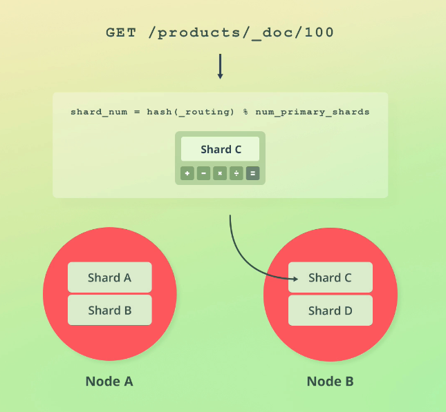

Cependant, il est possible de modifier la stratégie de routage. Dans ce cas, le `champ _routing` sera visible dans les résultats de recherche.  
La tratégie par défaut a pour atout de répartir de manière équitable les documents sur les shards.  
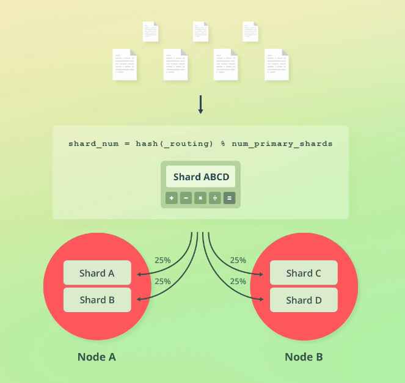

Important : Le nombre de shards est utilisé dans la formule de routage, c'est la raison pour laquelle il n'est pas possible de modifier ce paramètre une fois l'index créé !  
C'est pourquoi il faut réindexer en cas de changement de nombre de shards (voir les API Shrink et Split).  
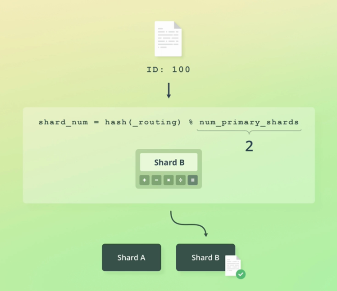

### Commment Elasticsearch lit les données :
```
GET /products/_doc/100
```

Un noeud reçoit la requête de lecture, ce noeud est responsable de la coordination de la requête, c'est le noeud de coordination.

1. Où se trouve le document recherché ? C'est le routage. Dans quel shard est le document ? Cela peut être le shard primaire ou les shards secondaires. Mais le shard choisi est un shard de réplication. Pour cela Elasticsearch utilise une technique appelé Adaptive Replica Selection (ARS) qui va choisir le replica jugé être le meilleur pour cette requête. Par meilleur on entend celui qui offre la meilleure performance.

2. Une fois le shard sélectionne, le noeud de coordination envoie la requête de lecture à ce shard.

3. Le noeud de coordination renvoie le résultat au client.

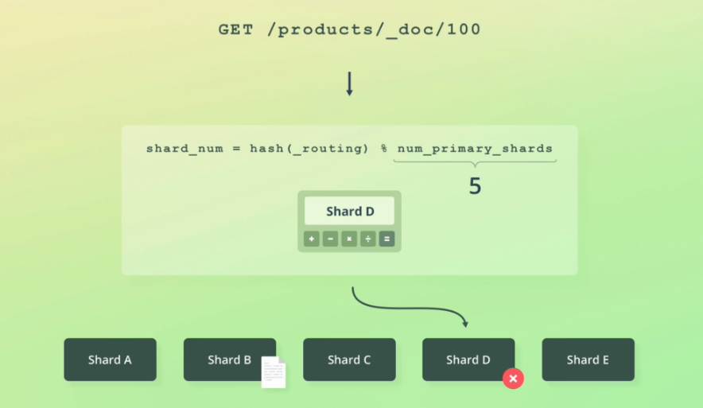

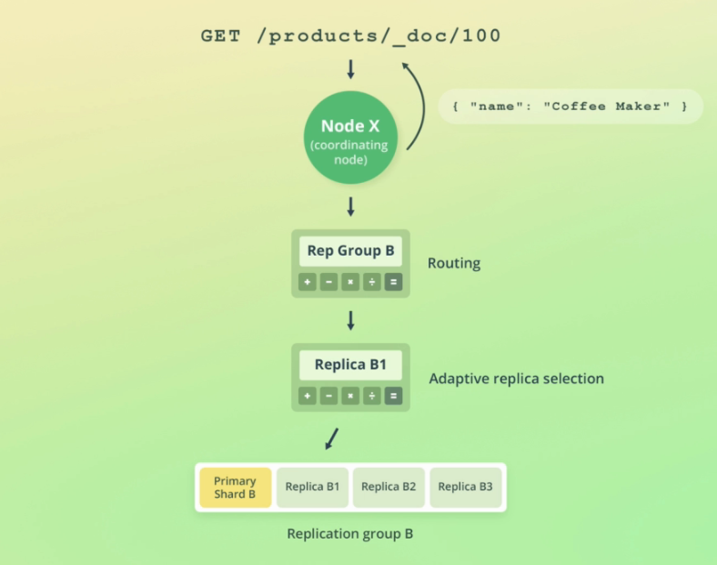

### Comment Elasticsearch ecrit les données :
```
PUT /products/_doc/100
```

1. Où ecrire le document ? C'est le routage. Sauf que la requête sera dirigée vers le shard primaire cette fois-ci. Le shard primaire est le premier responsable de la validation de la requête. Cela implique la validation de la structure de la requête, ainsi que la validation des valeurs de champs.

2. Le chard primaire exécute l'ecriture localement, avant de la diffuser sur les shards de réplication de manière parallèle.

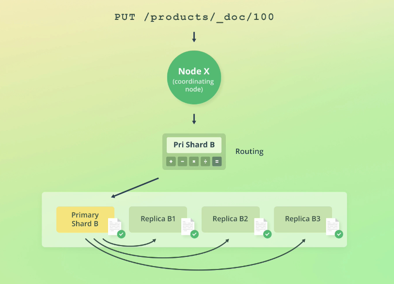

Que se passe-t-il losrque la copie à partir du shard primaire échoue ? Par exemple parce que le shard primaire plante pendant cette opération. Un nouveau shard primaire est désigné mais les données risque d'être incohérente.

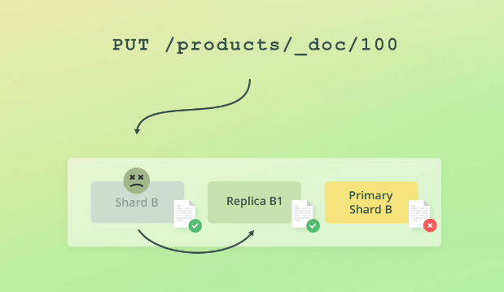

##### Primary Terms :
* Une manière de distinguer entre les nouveaux et les anciens shards primaires.
* Pour un groupe de réplication c'est le compteur du nombre de fois qu'a été changé le shard primaire.
* Ils sont persistés dans l'état du cluster.

Ainsi le shard de copie qui reçoit l'opération d'ecriture peut savoir si le shard primaire a changé entre temps.

##### Sequence Number :
* Un compteur qui est incrémenté à chque opération, au moins jusqu'à ce que le shard primaire change.
* Le shard primaire est le responsable de l'augmentation de ce numéro de séquence quand il traite une opération d'ecriture.
* Il permet à Elasticsearch d'ordonner les opérations d'ecriture.

Ces deux paramètres permettent à Elasticsearch de mieux savoir quelles opérations d'écriture doivent être réalisées.  
Cela lui permet de recouvrer les opérations en cas de plantage du shard primaire.

Enfin chaque groupe de réplication posséde un checkpoint global et chaque shard de réplication un checkpoint local.

- Le checkpoint global est le dernier numéro de séquence sur lequel s'alignent tous les shards actifs d'un groupe de réplication. Cela signifie que toutes le opérations avec un numéro de séquence inférieur ont été répliquées avec succès. Il sera ainsi utilisé pour la reprise des données lorsqu'un shard refonctionne et doit être mis à niveau.
- Le checkpoint local est le numéro de séquence de la dernière opération de lecture réalisée. Ainsi, lorsque le shard est de nouveau fonctionnel, Elasticsearch n'a besoin de comparer que les opérations dont le numéro de séquence est supérieur au chackpoint local.

### Versioning :

Ce n'est pas pour historiser les versions des documents. Elasticsearch stocke seulement la version la plus récente d'un document.  
La valeur initiale est 1 et est incrémentée à chaque modification du document.  
En cas de suppresion, Elasticsearch garde le numéro de version 60 secondes (par défaut, à configurer dans index.gc_delete). Si un document avec le même identifiant est indexé durant ces 60 secondes, le numéro de version est incrémenté, sinon il est réinitialisé.

Il existe deux types de versioning :

- Interne (par défaut), c'est à dire le versioning dans Elasticsearch.
- Externe qui peut être utilisé lorsque les versions sont entretenues en dehors d'Elasticsearch, comme des documents stockés dans un SGBD.

Le versioning est surtout un reliquat du passé et n'est plus très utilisé. C'était utilisé pour le contrôle de concurrence optimiste mais ce n'est plus le cas. Il sert juste à savoir combien de fois un document a été modifié.

### Contrôle de concurrence optimiste :

La gestion des accès concurrents est essentielle pour éviter qu'une ancienne version d'un document n'en écrase une plus récente par inadvertance. Comme Elasticsearch est distribué et dépend des accés réseaux, c'est un scénario qui n'est pas à exclure.

Ici un exemple de mise à jour du stock pour notifier une vente en reduisant le stock d'une unité :  
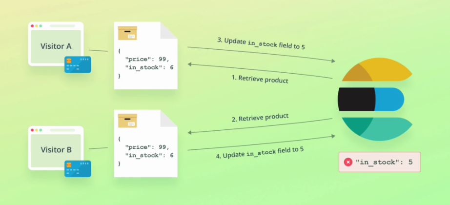

L'achat du visiteur B devrait donner un stock de 4 mais dans ce cas cela donne une incohérence sans que personne ne s'en rende compte ! Cela peut produire la vente de produits qui ne sont plus en stock !!!  
Ce qui serait cohérent c'est que le deuxième update plante si le document a entre temps été modifié.

Pour cela il y a 2 options :

1. Utiliser le numéro de version du document lors de l'update :  
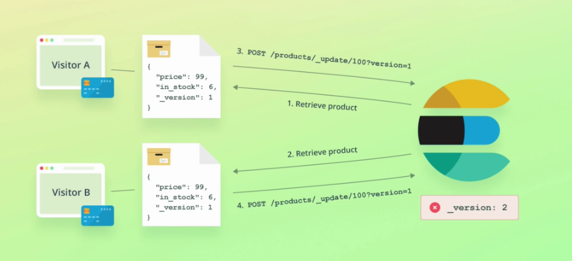

Mais cette approche a été deprécié car elle ne couvre pas tous les cas.

2. Utiliser le primary term et le numéro de séquence du document :  
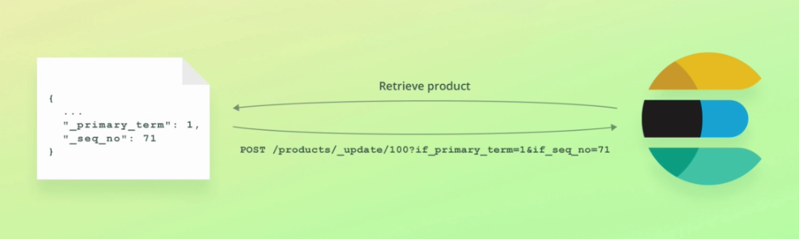  

Elasticsearch va utiliser ces deux paramètres pour s'assurer que le document à modifier n'a pas changé depuis la dernière lecture.

Ainsi en cas d'echec, une erreur est remontée par Elasticsearch :  
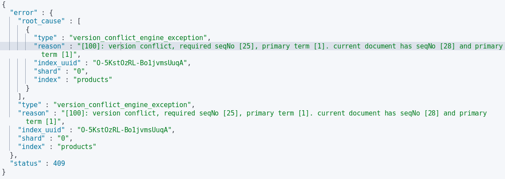 

L'erreur doit être gérée au niveau applicatif en récupérant la dernière version du document avant mise à jour.

### Modfier avec une requête :

Similaire à une requête UPDATE avec une clause WHERE en relationnel.

Modifier des documents correspondant aux critères d'une requête.

Pour cela il faut appeler l'API `_update_by_query`.  
Il est possible de remplacer la query match_all par n'importe quelle autre query.

Ici tous les produits verront leur stock diminué d'une unité :
```
POST /products/_update_by_query
{
  "script": {
    "source": "ctx._source.in_stock--"
  },
  "query": {
    "match_all": {}
  }
}
```

Dans la réponse Elasticsearch renvoie le nombre de documents mis à jour.

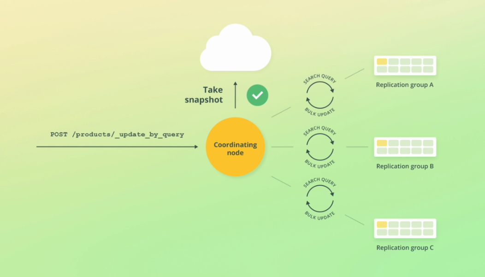 
En interne, pour ce qui est de la recherche, Elasticsearch utilise l'API Scroll pour un traitement par lots et pour une meilleure gestion des erreurs. Car en cas d'erreur, Elasticsearch va retenter 10 fois sur le même lot. Si au bout de 10 tentatives c'est toujours un échec, c'est la requête sur le lot qui est avortée mais les autres modifications sont maintenues même si la requête globale est marquée en échec.  
La requête n'est donc PAS TRANSACTIONNELLE !

La raison pour laquelle Elasticsearch prend un snapshot est d'assurer que les modifications seront exécutées l'état de l'index au moment où la requête est reçue.  
Donc un document est mis à jour seulement si les numéros de séquence sont égaux à ceux du snapshot.  
Le nombre de conflits de version est retournés dans le champs version_conflicts.

##### Ignorer les conflicts de versions et éviter que la requête soit avortée :
L'attribut conflicts doit être rajouter aux paramètres de la requête, ou `conflicts=proceed` à l'URL.  
Cela permet de remonter le nombre de conflits de version sans que la requête ne plante.
```
POST /products/_update_by_query
{
  "conflicts": "proceed",
  "script": {
    "source": "ctx._source.in_stock--"
  },
  "query": {
    "match_all": {}
  }
}
```

### Supprimer avec une requête :

Similaire à une requête DELETE avec une clause WHERE en relationnel.  
Suppression de tous les produits stockés dans l'index, la requête est très similaire à celle du `_update_by_query` :
```
POST /products/_delete_by_query
{
  "query": {
    "match_all": { }
  }
}
```

##### Ignorer les conflicts de versions et éviter que la requête soit évortée :
Comme pour le update_by_query, l'attribut conflicts doit être rajouter aux paramètres de la requête, ou `conflicts=proceed` à l'URL.

### Batch processing :

L'objectif est de réaliser les opérations vues précédemment (indexer, modifier, supprimer) sur un lot de documents avec une seule requête : Pour cela utiliser l'API Bulk.  
Cette API accepte des lignes au format Json séparées par des `\n` ou des `\r\n`
, basée sur la spécification NDJSON.  
Le format du fichier est :
```
action_and_meta_data\n
optional_source\n
action_and_meta_data\n
optional_source\n
...
```

L'action est définie en tant que clé et la valeur est un objet JSON qui représente le document concerné, dans l'objet action_and_meta_data.  
Les données concernant le document en question sont définies dans la ligne suivante en tant qu'objet JSON.

##### Indexer des documents :
Le nom de l'index n'est pas spécifié dans le path de la requête, mais dans les lignes action_and_meta_data :
```
POST /_bulk
{ "index": { "_index": "products", "_id": 200 } }
{ "name": "Espresso Machine", "price": 199, "in_stock": 5 }
{ "create": { "_index": "products", "_id": 201 } }
{ "name": "Milk Frother", "price": 149, "in_stock": 14 }
```

Ici le nom de l'action est index. Il existe aussi une autre action pour indexer des documents : create.  
La différence est que le create plante si un document existe déjà avec le même identifiant.

##### Modifier et supprimer des documents :
Le type d'opération est spécifié dans les lignes action_and_meta_data :
```
POST /_bulk
{ "update": { "_index": "products", "_id": 201 } }
{ "doc": { "price": 129 } }
{ "delete": { "_index": "products", "_id": 200 } }
```

##### Spécifier le nom de l'index dans le path de la requête :
Cela peut être pratique si on veut charger le même fichier sur des index avec des noms différents :
```
POST /products/_bulk
{ "update": { "_id": 201 } }
{ "doc": { "price": 129 } }
{ "delete": { "_id": 200 } }
```

Une action en échec ne va pas affecter les autres actions. Raison pour laquelle Elasticsearch retourne le détail de toutes les opérations.  
La clé "errors" renseigne sur les erreurs qui se sont produites durant le traitement du bulk.

L'API Bulk est bien plus performante que l'envoi de multiples requêtes uniques, cela réduit le traffic réseau.

- Utiliser l'API Bulk avec cURL pour importer des données :
```
$ curl -H "Content-Type: application/json" -XPUT localhost:9200/tmdb?pretty --data-binary @tmdb-mapping.json
$ curl -H "Content-Type: application/json" -XPOST localhost:9200/_bulk?pretty --data-binary @tmdb.json
```

Le contenu du fichier est envoyé en tant que données binaires pour préserver les retours chariot.
