# Analyse

### Introduction à l'analyse :

* L'analyse dans Elasticsearch est seulement applicable aux champs textuels.
* Lorsqu'un document est indexé les valeurs textuelles sont analysées.
* Le résulat est stocké dans des structures de données qui permettent de rendre la recherche efficiente.

Lors d'une recherche les objets retrouvés sont retournés dans le champ `_source`. Cet objet contient la valeur exacte qui a été spécifiée lors de l'indexation du document. Cependant, l'objet _source n'est pas utilisé lors de la recherche de documents. Une description longue d'un produit ne peut être efficiente pour réaliser une recherche si stockée en l'état. C'est la raison pour laquelle les champs textuels sont traités avant d'être stockés !  
Ce sont les Analyzers qui traitent les valeurs textelles.  
Un analyzer est constitué de trois blocs :  
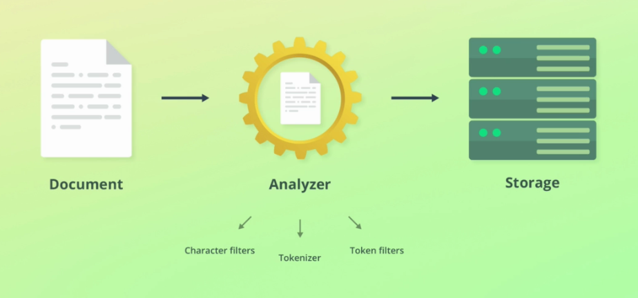

1. Charachter filters :
* Ils peuvent ajouter, supprimer ou modifier des caractères.
* Un analyzer peut avoir 0 ou plusieurs charachter filters qui sont appliqués dans l'ordre dans lequel ils sont spécifiés.

2. Tokenizer :
* Un analyzer contient un tokenizer.
* Il est responsable du découpage du texte en tokens.
* Le tokenizer enregistre également la position de chaque tokenizer.

3. Token filters :
* Reçoivent en entrée le résultat du Tokenizer.
* Ils peuvent ajouter, supprimer ou modifier des tokens.
* Un analyzer peut avoir 0 ou plusieurs token filters qui sont appliqués dans l'ordre dans lequel ils sont spécifiés (exemple : lowercase).

Elasticsearch embarque un certain nombre d'analyzers, charachter filters, tokenizers et token filters :  
https://www.elastic.co/guide/en/elasticsearch/reference/current/analysis-analyzers.html

Exemple de traitement de l'analyzer standard par défaut :  
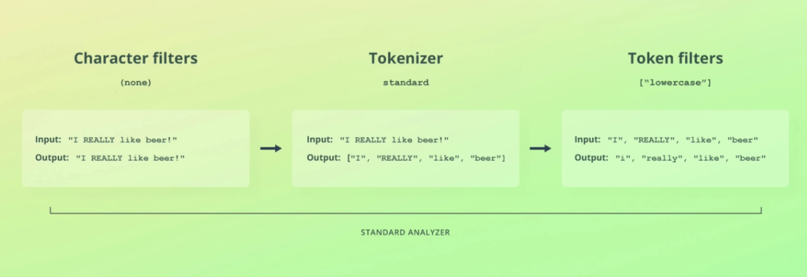

### L'API Analyze :

Découpage en tokens d'un texte avec le tokenizer de type standard.  
Il supprime les symboles de ponctuation, les émoticones, les espaces... Tout ce qui n'est pas pertinent pour de la recherche textuelle.
```
POST _analyze
{
  "tokenizer": "standard",
  "text": "I'm in the mood for drinking semi-dry red wine!"
}
```

Utilisation du filtre lowercase :
```
POST _analyze
{
  "filter": [ "lowercase" ],
  "text": "I'M IN THE MOOD FOR DRINKING SEMI-DRY RED WINE!"
}
```

Utilisation de l'analyzer de type standard :
```
POST _analyze
{
  "analyzer": "standard",
  "text": "I'm in the mood for drinking semi-dry red wine!"
}
```

Cela équivaut à :
```
POST _analyze
{
  "text": "I'm in the mood for drinking semi-dry red wine!",
  "char_filter": [],
  "tokenizer": "standard",
  "filter": ["lowercase"]
}
```

### Les index inversés :

* Les valeurs de champs sont stockées dans une ou plusieurs structures de données. La structure de données dépend du type du champ.
* Ces structures assurent l'efficacité de la recherche et de la récupération de données.
* Elles sont gérées par Apache Lucene et non pas Elasticsearch.

L'une de ces tructures de données sont les index inversés :

- C'est un mapping entre les termes et les documents qui les contiennent.
- Par terme on entend les tokens émis par l'analyzer.
- Les termes sont triés par ordre alphabétique.
- Les index inversés contiennent d'autres données que le terme et l'identifiant du document comme le score de pertinence.


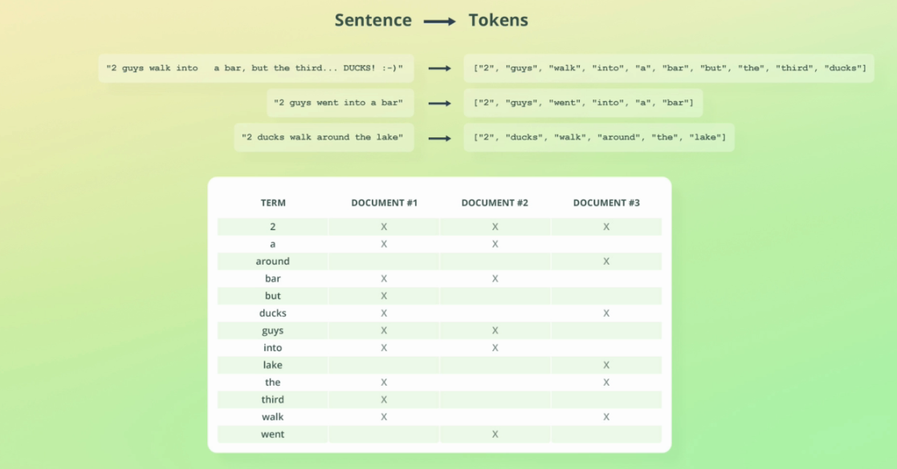  
Ce qui rend un index inversé si puissant c'est qu'il rend la recherche de termes très efficace et très simple.

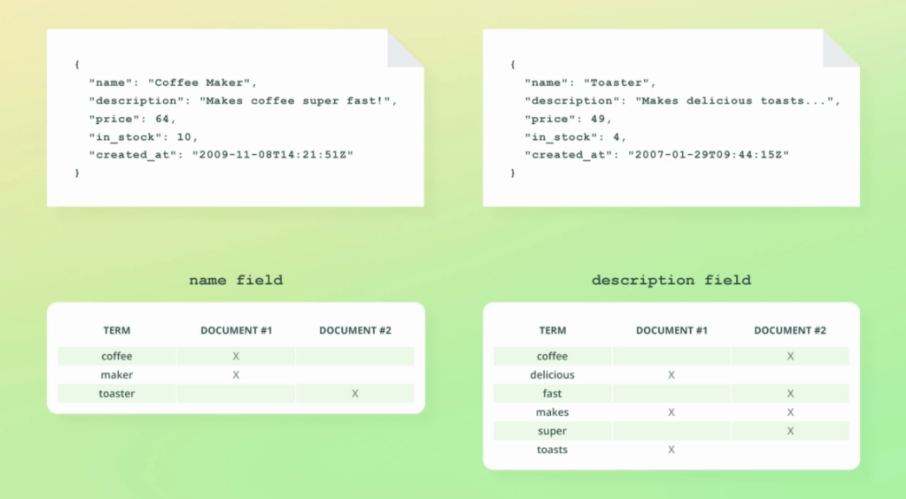

Un index inversé est stocké pour chaque champ texte.

Les autres types de données (nombres, dates ou géolocalisations) sont stockés dans des arbres KDB.  
> https://medium.com/swlh/bkd-trees-used-in-elasticsearch-40e8afd2a1a4

##### Doc_values :

C'est une structure de données utilisées par Apache Lucene qui est optimisée pour un pattern différent d'accès aux données : document -> termes. C'est un index non inversé.  
Elle est utilisée pour le tri, les aggrgations et l'accès au valeurs de champs dans les objets scripts. Elle cohabite avec l'index inversé.  
Elle peut être désactivée pour réduire l'utilisation de l'espace de stockage ("doc_values" : false) car son utilisation implique une duplication des données. Cela implique une perte de performance pour les opérations de lecture mais un gain de performance pour l'écriture.  
Il est possible de la désactiver lorsqu'un champs ne sera pas utilisé pour des aggrégations, du tri ou dans des scripts.  
A noter que le paramètre ne peut être modifié sans réindexer les documents dans un nouvel index.

### Stemming et stop words :
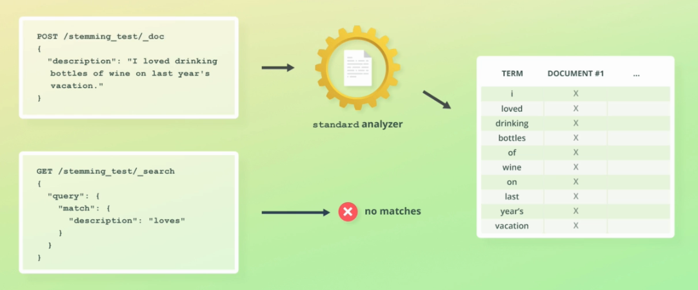

Pour les champs textuels l'analyzer par défaut met les mots en miniscule, supprime la ponctuation et découpe le texte en tokens.  


Dans ce cas le temps auquel est conjugué un verbe a un impact sur la recherche. Le pluriel et le singulier également.  
Il serait plus pertinent de faire converger toutes les conjugaisons possibles du même verbe. Cela permettrait aux utilisateurs de faire des recherches sans prendre en considération la conjugaison ou le pluriel par exemple.  

* **Stemming :** Il réduit les mots à leur racine.


* **Stop words :** Ce sont les mots filtrés lors de l'analyse du texte. Cela peut être n'importe quel mot mais en général ce sont les mots les plus communs d'une langue et que l'on considère comme non pertinents pour une recherche.  
En Anglais cela peut être : "a", "the", "at", "of", "on", etc.  
Leur suppression améliore considérablement la pertinence de l'algorithme de recherche.  


### Les analyzers et la recherche :
Dans l'exemple ci-dessous le stemming est activé.  
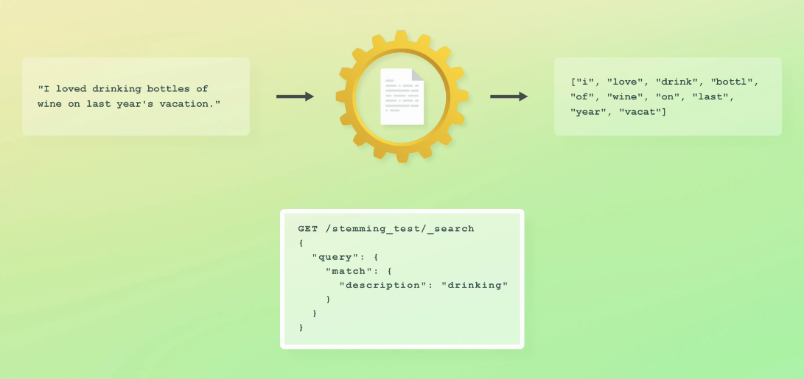
Que se passera-t-il lors de la recherche du mot "drinking" ? A noter que le mot "drinking" a été réduit à sa racine.  
Le recherche fonctionnera parce que le requête de recherche est également analysée de la même manière que l'est le document lors de son indexation. Cependant le valeur initiale du texte est toujours présente et inchangée dans l'objet `_source`.  
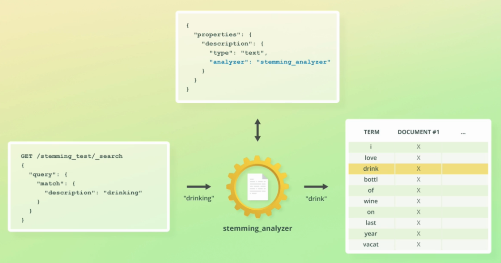

### Les analyzers embarqués :
Ce sont des combinaisons pré-configurées de charachter filters, tokenizers et token filters.

##### Standard : 
* Découpe le texte au niveau des espaces, supprime la ponctuation et met tous les caractères en miniscule.
* Contient le token filter "stop" mais il n'est pas activé.

##### Simple :
* Découpe le texte à chaque caractère qui n'est pas une lettre. Il met également tous les caractères en miniscule.

##### Whitespace :
* Découpe le texte au niveau des espaces, mais ne supprime pas la ponctuation et ne met pas les caractères en miniscule.

##### Keyword :
* C'est un analyzer de type no-op ce qui veut dire qu'il laisse le texte en entrée intacte.
* Par défaut, il est utilisé pour les champs de type keyword.

##### Pattern :
* Utilise une expression régulière pour matcher les séparateurs afin de découper le texte en tokens.
* L'expression régulière configurée par défaut est `\W+`.
* Il met également tous les caractères en miniscule.

https://www.elastic.co/guide/en/elasticsearch/reference/current/analysis-analyzers.html

Il existe également des analyzers par langue, par exemple l'anglais :  
https://www.elastic.co/guide/en/elasticsearch/reference/current/analysis-lang-analyzer.html#english-analyzer
```
PUT /products
{
  "mappings": {
  	"properties": {
  	  "description": {
  	  	"type": "text",
  	  	"analyzer": "english"
  	  }
  	}
  }
}
```

Configurer un analyzer embarqué en rajoutant les stop words :
```
PUT /prodcuts
{
  "settings": {
    "analysis": {
      "analyzer": {
        "std_english": { 
          "type":      "standard",
          "stopwords": "_english_"
        }
      }
    }
  }
}
```

### Configurer un analyzer :
```
PUT /analyzer_test
{
  "settings": {
    "analysis": {
      "analyzer": {
        "my_custom_analyzer": {
          "type": "custom",
          "char_filter": ["html_strip"],
          "tokenizer": "standard",
          "filter": [
            "lowercase",
            "stop",
            "asciifolding"
          ]
        }
      }
    }
  }
}
```

1. Le type custom d l'analyzer dit à Elasticsearch que cet analyzer est un analyzer customisé et qu'il n'étend aucun analyzer embarqué.
2. Le charachter filter html_strip filtre les tags HTML et convertit les entités HTML (par exemple `&nbsp;`) en leur valeur décodée.
3. Le token filter asciifolding convertit les caractères spéciaux en leur équivalent en ASCII (par exemple ç en c ou í an i) afin de faciliter la recherche.
3. Par défaut, le token filter stop enlève les stop words de la langue anglaise.

Pour tester l'analyzer customisé précédemment créé :
```
POST /analyzer_test/_analyze
{
  "analyzer": "my_custom_analyzer", 
  "text": "I&apos;m in a <em>good</em> mood&nbsp;-&nbsp;and I <strong>love</strong> açaí!"
}
```

Configurer un stop word pour une langue spécifique qui étend le comportement par défaut (anglais) :
```
PUT /analyzer_test
{
  "settings": {
    "analysis": {
      "filter": {
        "danish_stop": {
          "type": "stop",
          "stopwords": "_danish_"
        }
      },
      "char_filter": {
        # Add character filters here
      },
      "tokenizer": {
        # Add tokenizers here
      },
      "analyzer": {
        "my_custom_analyzer": {
          "type": "custom",
          "char_filter": ["html_strip"],
          "tokenizer": "standard",
          "filter": [
            "lowercase",
            "danish_stop",
            "asciifolding"
          ]
        }
      }
    }
  }
}
```

##### Ajouter un analyzer à un index existant :

Pour cela il faut que l'index soit à l'état closed, c'est à dire qu'il refuse l'indexation et les recherches.  
Dans le contexte des settings d'un index, il y deux types de settings, les statiques et les dynamiques. Contrairement aux settings statiques, les settings dynamiques ne peuvent être modifiés que sur un index à l'état open.
```
POST /analyzer_test/_close
```

```
PUT /analyzer_test/_settings
{
  "analysis": {
    "analyzer": {
      "my_second_analyzer": {
        "type": "custom",
        "tokenizer": "standard",
        "char_filter": ["html_strip"],
        "filter": [
          "lowercase",
          "stop",
          "asciifolding"
        ]
      }
    }
  }
}
```

```
POST /analyzer_test/_open
```

Retrouver les settings de l'index :
```
GET /analyzer_test/_settings
```

##### Modifier un analyzer :
Pour cela aussi il faut que l'index soit à l'état closed.
```
POST /analyzer_test/_doc
{
  "description": "Is that Peter's cute-looking dog?"
}
```
```
PUT /analyzer_test/_settings
{
  "analysis": {
    "analyzer": {
      "my_custom_analyzer": {
        "type": "custom",
        "tokenizer": "standard",
        "char_filter": ["html_strip"],
        "filter": [
          "lowercase",
          "asciifolding"
        ]
      }
    }
  }
}
```
```
POST /analyzer_test/_doc
{
  "description": "Is that Peter's cute-looking dog?"
}
```

Cela reste délicat car il y aura des documents analysés de manières différentes dans le même index. Ce qui peut engendrer des incompréhensions sur les recherches.  
Par exemple pour les deux documents similaires indexés, la recherche par "that" ne va renvoyer que le deuxième car le token filter stop words a été supprimé. C'est déroutant. Réindexer pour que tous les documents soient analysés de la même manière résoud le problème en passant par un `update_by_query` :
```
POST /analyzer_test/_update_by_query?conflicts=proceed
```

### Les synonymes :

Creation d'un index avec un analyzer customisé. Cet analyzer utilise un token filter pour la définition des synonymes.
Le token filter a pour type `synonym`, y seront définis les synonymes en tant que tableau de correspondances, c'est à dire des termes qui seront remplacés par d'autres termes.
Ainsi, selon la configuration ci-dessous le terme "awful" sera remplaçé par "terrible" dans l'index inversé :
```
PUT /synonyms
{
  "settings": {
    "analysis": {
      "filter": {
        "synonym_test": {
          "type": "synonym", 
          "synonyms": [
            "awful => terrible",
            "awesome => great, super",
            "elasticsearch, logstash, kibana => elk",
            "weird, strange"
          ]
        }
      },
      "analyzer": {
        "my_analyzer": {
          "tokenizer": "standard",
          "filter": [
            "lowercase",
            "synonym_test"
          ]
        }
      }
    }
  },
  "mappings": {
    "properties": {
      "description": {
        "type": "text",
        "analyzer": "my_analyzer"
      }
    }
  }
}
```

Remplacement de "awesome" par "great" et "super".
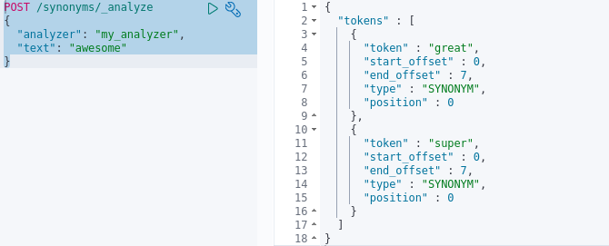

Pour ce qui est de la configuration "weird, strange", elle ne fait pas de remplacement mais accompagne un élément par les autres de la liste.  
A noter que tous les mots sont en miniscules parce que le token filter "lowercase" est appliqué juste avant celui des synonymes. Cela a son importance.  
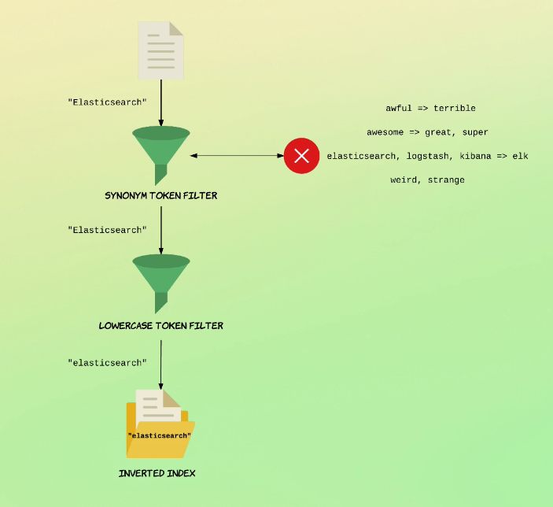

Pour que la recherche prenne en considération les synonymes il faut utiliser des requêtes qui sont analysées. Les requetes de type term risquent de donner des résultats inappropriés.  
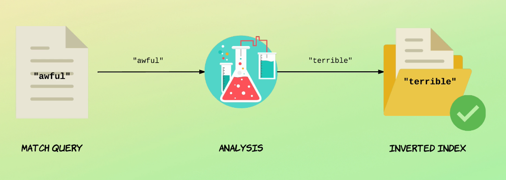 

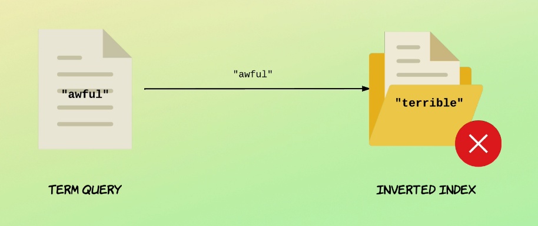

##### Ajouter des synonymes à partir d'un fichier :
```    
    "synonym_test": {
      "type": "synonym",
      "synonyms_path": "analysis/synonyms.txt"
    }
```

Le chemin du fichier est relatif par rapport au dossier de config d'Elasticsearch.  
Il faut relancer le noeud pour que le fichier soit pris en compte. Il faut aussi que le fichier soit présent sur tous les noeuds qui stockent des documents.

Exemple de fichier de synonymes :
```
### This is a comment

awful => terrible
awesome => great, super
elasticsearch, logstash, kibana => elk
weird, strange
```