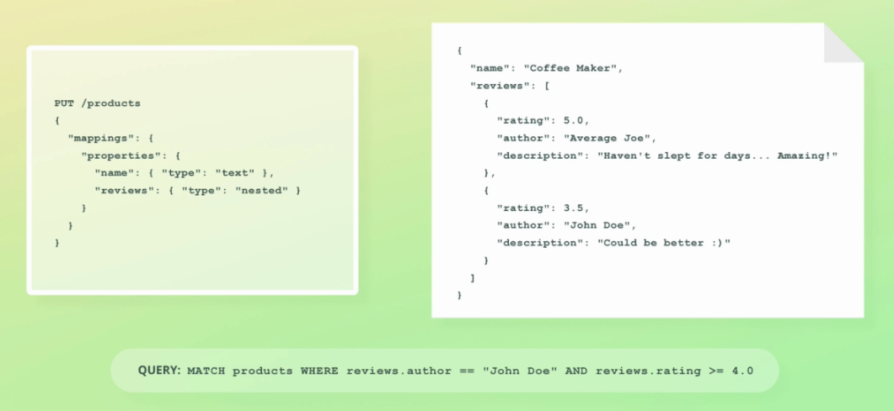
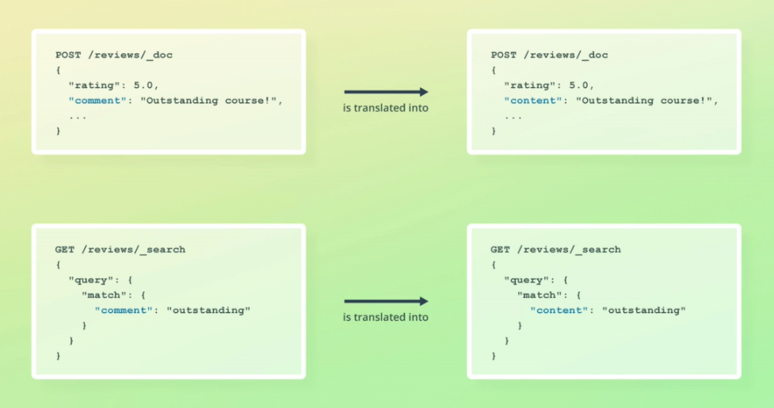
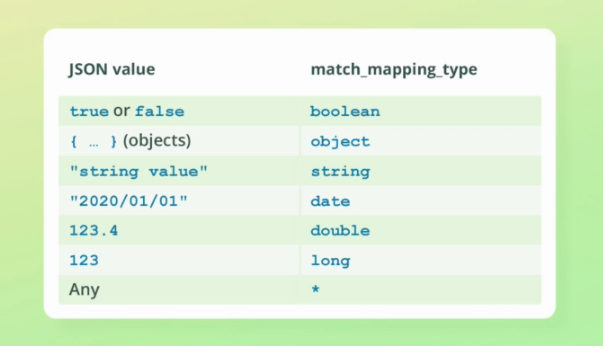

# Mapping

* Le mapping décrit la structure des documents (champs et types de données) et comment ils sont stockés.
* Similaire au schéma d'une table en base de données relationnel.


Il existe deux types de mapping :

- **Mapping explicite :** défini par l'utilisateur lors de la création de l'index.
- **Mapping implicite :** généré par Elasticsearch qui inspecte les données lors de leur chargement et essaye de leur trouver un type.

Les deux approches peuvent être combinées pour un même index.

### Les types de données :
https://www.elastic.co/guide/en/elasticsearch/reference/current/mapping-types.html

##### object : 
* Utilisé pour n'importe que objet JSON. Les objets peuvent être imbriqués.
* Pour leur mapping on utilise un clé properties pour en décrire la structure au lieu de la clé type.
* Ils ne sont pas stockés en tant qu'objet dans Apache Lucene. Ils sont transformés au préalable, ils sont applatis.


Que se passe-t-il pour les tableaux de données ?


La relation entre les objets dans les tableaux sont perdues. Pour éviter cela il faut utiliser les objets de type nested.

##### nested :
* Contrairement aux objets, ils maintiennent les relations entre les objets. Pratique pour les tableaux.
* Permet de requêter des objets de manière indépendante et ne pas les mélanger, grâce aux requêtes nested.


Comment Apache Lucene les stocke-t-il ? En tant que documents cachés. Ces documents ne seront retournés que si ils sont directement requêtés.  


##### keyword :
* Utilisé pour les champs quand veut utiliser pour une correspondance exacte.
* Utilisé pour le filtrage, l'aggrégation ou le tri.

##### arrays :
* Il n'y a pas de type array dans Elasticsearch.
* Chaque champ peut contenir 0 ou plusieurs valeurs. Nul besoin de mapping.
```
	"tags" : "Smartphone" <=> "tags" : [ "Smartphone", "Electronics" ]
```

Pour mieux comprendre :
```
POST /_analyze
{
  "text": ["Strings are simply", "merged together."],
  "analyzer": "standard"
}
```

Le tableau est considéré comme un seul texte après concaténation : "Strings are simply merged together."   
Par contre les valeurs du tableau doivent être du même type de données.  
Il est possible d'utiliser des tableaux imbriqués. Dans ce cas ils seront aplatis : [1, [2, 3]] devient [1, 2, 3].

##### date :

Les dates peuvent être spécifiés de 3 manières différentes :

- Des chaines de caractères formatées (doivent correspondre à la norme ISO 8601).
- Un long représentant le nombre de millisecondes depuis epoch (1er Janvier 1970) (epoch_millis).
- Un entier représentant le nombre de secondes depuis epoch (epoch_second).

Par défaut Elasticsearch considère qu'une date est en UTC timezone.

  
Toutes les dates sont stockées en millisecondes (depuis le 1er Janvier 1970) et converties en UTC timezone.

Mapping de date avec le format year :
```
PUT /products/_mapping
{
  "properties": {
    "created": {
      "type": "date",
      "format": "year"
    }
  }
}
```

Mapping explicite de date avec format de date et heure optionnelle. Si l'heure n'est pas spécifiée Elasticsearch considère que c'est minuit.
```
PUT /products/_mapping
{
  "properties": {
    "created": {
      "type": "date",
      "format": "yyyy/MM/dd HH:mm:ss||yyyy/MM/dd"
    }
  }
}
```

https://www.elastic.co/guide/en/elasticsearch/reference/current/mapping-date-format.html

Date uniquement : 
```
"created_at": "2015-04-15T13:07:41Z"
```

ISO-8601 (Z indique que c'est la timezone UTC) : 
```
"created_at": "2015-04-15T13:07:41Z"
```

UTC offset : 
```
"created_at": "2015-01-28T09:21:51+01:00"
```

### Keywords :
Les champs de type keyword sont analysés par un keyword analyzer. Cet analyzer est ce qu'on appelle un no-op analyzer, c'est à dire qu'il ne fait rien. Il retourne la chaine de caractères compléte en un seul token. La chaine de caractères n'est d'aucune sorte modifiée, car elle sera utilisée pour les correspondances exactes.
```
POST _analyze
{
  "analyzer": "keyword",
  "text": "I'm in the mood for drinking semi-dry red wine!"
}
```

Un cas d'utilisation plus pertinent serait pour les adresses mail. Pour ce faire, il est possible de configurer l'analyzer keyword avec un token filter lowercase.

### Coércition de données :

* Les types de données sont inspectées lors de l'indexation des documents.  
Ils sont validés et certaines valeurs non valides sont rejetées (par exemple un texte en tant que nombre).

* Pour certains cas cela fonctionne comme stocker "7.4" (au lieu de 7.4) en tant que float par conversion (ou un 7.4 en tant que integer).  
Dans ce cas la valeur 7.4 sera indexée mais dans _source il y aura la valeur originelle "7.4" en tant que chaine de caractères. En effet, _source ne reflète pas comment les données sont indexées.

* Il est possible de désactiver la coériction. Ce qui est plutot conséillé.

L'activation (valeur par défaut) ou désactivation de la coércition se fait par le paramètre coerce.
```
PUT /reviews {
  "settings": {
  	"index.mapping.coerce": false
  },
  "mappings": {
    "properties": {
      "rating": { 
      	"type": "float",
      	"coerce": true
      }
    }
  }
}
```

### Mapping explicite :
Cela crée également l'index !
```
PUT /reviews
{
  "mappings": {
    "properties": {
      "rating": { "type": "float" },
      "content": { "type": "text" },
      "product_id": { "type": "integer" },
      "author": {
        "properties": {
          "first_name": { "type": "text" },
          "last_name": { "type": "text" },
          "email": { "type": "keyword" }
        }
      }
    }
  }
}
```

Pour retrouver le mapping d'un index :
```
GET /reviews/_mapping
```

Ou d'un champ :
```
GET /reviews/_mapping/field/content
GET /reviews/_mapping/field/author.email
```

Ce mapping est équivalent au précédent :
```
PUT /reviews_dot_notation
{
  "mappings": {
    "properties": {
      "rating": { "type": "float" },
      "content": { "type": "text" },
      "product_id": { "type": "integer" },
      "author.first_name": { "type": "text" },
      "author.last_name": { "type": "text" },
      "author.email": { "type": "keyword" }
    }
  }
}
```

Il en résultera la même mapping car Elasticsearch saura interpréter author comme un objet :
```
GET /reviews/_mapping
```

Ajouter un mapping à un index existant grâce à l'API mapping :
```
PUT /reviews/_mapping
{
  "properties": {
    "created_at": {
      "type": "date"
    }
  }
}
```

##### Paramètres de Mapping :
* **norms :** les facteurs de normalisation sont utilisés pour le calcul de pertinence. Ils peut être désactivé pour les champs dont le calcul de pertinence n'apporte rien afin de diminuer le stockkage. Principalement les champs qui sont dédiés au filtrage et aux aggrégations.

* **index :** Afin de désactiver l'indexation d'un champ, qui ne pourra pas être utilisé pour la recherche mais sera quand même présent dans _source. Cela diminue le stockage et rend l'indexation un peu plus rapide.

* **null_value :** Afin de remplacer les valeurs nulles par une valeur au choix lors de l'indexation. Pour cela il faut que la valeur de remplacement soit du même type que celui du champ. A noter que cela ne fonctionne que pour les champs dont la valeur est NULL de manière explicite et que cela n'affecte pas la valeur stockée dans _source.
```
      "partner_id": { 
      	"type": "keyword",
      	"null_value": "NULL"
      }
```
* **copy_to :** Utilisé pour copier les valeurs de plusieurs champs dans un unique champs "group field". Par exemple first_name et second_name vers full_name. Le champ cible ne sera pas dans _source.

Pour les autres paramètres :  
https://www.elastic.co/guide/en/elasticsearch/reference/current/mapping-params.html

### Valeurs nulles :

* Tous les champs dans Elasticsearch sont optionnels.
* On peut ne pas spécifier un champ en indexant un document.
* Pas de contraintes d'intégrité à ce niveau comme dans un SGBD.
* Les tests d'integrité de données doit se faire au niveau applicatif.

### Modifier un mapping existant :
Il est possible de modifier le mapping d'un index, mais en général pas le type d'un champ.  
Par exemple il est impossible de modifier un entier en keyword. C'est logique les deux types ne sont pas stockés de la même manière dans Apache Lucene (Arbre KBD Vs Index inversé).
```
PUT /reviews/_mapping
{
  "properties": {
    "product_id": {
      "type": "keyword"
    }
  }
}
```

Certains paramètres de mapping peuvent être modifiés.  
Le paramètre ignore_above peut être rajouté, par exemple :
```
PUT /reviews/_mapping
{
  "properties": {
    "author": {
      "properties": {
        "email": {
          "type": "keyword",
          "ignore_above": 256
        }
      }
    }
  }
}
```

La mise à jour du mapping peut être problématique pour les documents déjà indexés. Par exmple changer un champ de type text en un keyword n'est pas possible, parce que les valeurs ont déjà été analysées.  
Le mapping d'un champ ne peut pas être supprimé non plus. Utiliser un `update_by_query` pour supprimer toutes le valeurs.  
La solution la plus efficace est de réindexer les documents vers un nouvel index.

### Réindexer un index :
```
POST /_reindex
{
  "source": {
    "index": "reviews"
  },
  "dest": {
    "index": "reviews_new"
  }
}
```

Mais cela n'implique aucun changement de l'objet `_source` même si le type de certains champs change d'un index à un autre.  
On peut rajouter un script pour mettre à jour le type d'un champ à la volée :
```
POST /_reindex
{
  "source": {
    "index": "reviews"
  },
  "dest": {
    "index": "reviews_new"
  },
  "script": {
    "source": """
      if (ctx._source.product_id != null) {
        ctx._source.product_id = ctx._source.product_id.toString();
      }
    """
  }
}
```

Réindexer certains documents :
```
POST /_reindex
{
  "source": {
    "index": "reviews",
    "query": {
      "range": {
        "rating": {
          "gte": 4.0
        }
      }
    }
  },
  "dest": {
    "index": "reviews_new"
  }
}
```

Supprimer certains champs :
```
POST /_reindex
{
  "source": {
    "index": "reviews",
    "_source": ["content", "created_at", "rating"]
  },
  "dest": {
    "index": "reviews_new"
  }
}
```

Changer le nom de certains champs :
```
POST /_reindex
{
  "source": {
    "index": "reviews"
  },
  "dest": {
    "index": "reviews_new"
  },
  "script": {
    "source": """
      # Rename "content" field to "comment"
      ctx._source.comment = ctx._source.remove("content");
    """
  }
}
```

Ignorer certains champs en fonction d'un critère (utiliser le mot clé delete en tant qu'opération supprimera l'élément de l'index destination si il y existe déjà) :
```
POST /_reindex
{
  "source": {
    "index": "reviews"
  },
  "dest": {
    "index": "reviews_new"
  },
  "script": {
    "source": """
      if (ctx._source.rating < 4.0) {
        ctx.op = "noop"; # Can also be set to "delete"
      }
    """
  }
}
```

### Alias :
Le changement de nom d'un champ nécessite de réindexer les documents d'un index.  
Il existe une alternative qui est de définir des alias de champs. Pour cela il faut utiliser l'API mapping.

Ajouter un alias `comment` qui pointe sur le champ `content` :
```
PUT /reviews/_mapping
{
  "properties": {
    "comment": {
      "type": "alias",
      "path": "content"
    }
  }
}
```

L'alias n'a aucun impact sur le contenu de _source, mais on peut l'utiliser pour requêter sur le champ.

- Les alias sont un des attributs du mapping qui peuvent être mis à jour. Pas le nom mais le champ cible. Cela est possible parce qu'un alias n'a aucun impact sur le mapping.
- Il est également possible de configurer des alias d'index.  


### Mapping multi-champs :
Il est possible de mapper un champ de plusieurs manières. Par exemple un champs texte peut également étre mappé en tant que keyword.
```
PUT /multi_field_test
{
  "mappings": {
    "properties": {
      "description": {
        "type": "text"
      },
      "ingredients": {
        "type": "text",
        "fields": {
          "keyword": {
            "type": "keyword"
          }
        }
      }
    }
  }
}
```

Les deux champs pourront être utilisés pour des recherches textuelles.  
Ajouter le type keyword au champ ingredients permettrait de faire des aggrégations, par exemple tous les ingrédients et pour chaque ingrédients le nombre de recettes où elles sont utilisées.

Ce qui se passe lors de l'indexation d'un document :  


### Les templates d'index :
* Ils définissent les settings et mappings pour des index.
* Ils s'appliquent sur des index qui correspondent à 1 ou plusieurs patterns. Il sont stockés dans le champs index-patterns.
* Un pattern est une expression régulière avec un astérisque.
* Le template de l'index prend effet lors de la création de l'index.
```
Exemple :
PUT /_template/access-logs
{
  "index_patterns": ["access-logs-*"],
  "settings": {
    "number_of_shards": 2,
    "index.mapping.coerce": false
  }, 
  "mappings": {
    "properties": {
      "@timestamp": {
        "type": "date"
      },
      "url.original": {
        "type": "keyword"
      },
      "http.request.referrer": {
        "type": "keyword"
      },
      "http.response.status_code": {
        "type": "long"
      }
    }
  }
}
```

Lors de la création de cet index le template sera utilisé pour définir les settings et le mapping :
```
PUT /access-logs-2020-01-01
```

Il est possible de surcharger certains paramètres du template lors de la création de l'index :
```
PUT /access-logs-2020-01-01
{
  "settings": {
    "number_of_shards": 3
  }
}
```

Un nouvel index peut matcher avec plus template d'index. Dans ce cas, un paramètre nommé order peut être utilisé pour définir la priorité des templates d'index. Les templates avec la valeur la plus faible sont mergés en premier.

Un template d'index peut-être mis à jour via la même API que pour sa création, cela n'affectera que les prochains index créés :
```
PUT /_template/access-logs
{
	# Nouvelle configuration
}
```

### Elastic Common Schema (ECS) :
ECS est une spécification de champs communs et comment ils seront mappés dans Elasticsearch.  
ECS est apparu avec l'évolution des autres produits de la stack Elastic. Les valeurs ingérés pouvaient avoir des noms de champs différents pour décrire les mêmes données. Par exemple les champs de logs étaient différents d'un type de serveur à un autre (nginx, apache, etc.) : apache2.access.url Vs. nginx.access.url.  


ECS permet donc d'harmoniser les noms des champs entre les différentes sources de données. Cela permet une lecture plus simple des données, indépendamment de la source.  
Il définit des champs communs dans différents groupes tels que network, geolocation, etc. On appelle ces groupes des filed sets.  
Dans ECS, les documents sont quélifiés d'événements. La raison est que ECS inclue des champs pour différents types d'événements générés par différentes technologies. ECS ne fournit pas de champs pour les documents de type ne correspondant pas à des événements (par exemple : product).  
ECS est automatiquement géré pour les produits de la Stack Elastic.

### Mapping dynamique :
L'idée est de rendre Elasticsearch plus simple à utiliser en rendant la définition de mapping explicite facultative pour la création d'index.  
A chaque d'Elasticsearch rencontre un nouveau champ, il va créer un mapping pour ce champ, afin qu'il soit utilisé lors des indexations à venir.  


* Le champ in_stock a été inféré en tant que long et non pas int, Elasticsearch anticipe le stockage de grands chiffres dans ce champ.
* Le champs tags a été inféré avec un mapping multiple. Elasticsearch ne sait pas comment sera requêté ce champ, il rajoute le type keyword afin de permettre des aggrégations sur ce champ.

Ces mappings par défaut ne sont pas forcément les meilleurs et sont assez gourmand en stockage. Dans notre exemple le type text pour les tags n'est pas pertinent, ils ne seront surement pas utilisés pour de la recherche textuelle, mais plutot du filtrage ou de l'aggrégation. Par contre, un champs description ne sera jamais utilisé pour faire des aggrégations.  
Cependant le paramètre ignore_above est très pertinent car jamais un keyword ne peut dépasser 256 caractères et être utilisable pour du tri ou de l'aggrégation.

  
Un champ avec la valeur NULL sera ignoré par Elasticsearch pour ce qui est du mapping dynamique.

Il est possible de combiner mapping dynamique et mapping explicite. Le mapping dynamique est activé par défaut et sera appliqué à tous les nouveaux champs malgré l'existence d'un mapping explicite.

##### Configurer le mapping dynamique :

Pour désactiver le mapping dynamique :
```
PUT /people
{
  "mappings": {
    "dynamic": false,
    "properties": {
      "first_name": {
        "type": "text"
      }
    }
  }
}
```
```
POST /people/_doc
{
  "first_name": "Bo",
  "last_name": "Andersen"
}
```
```
GET /people/_mapping
```
```
{
  "people" : {
    "mappings" : {
      "dynamic" : "false",
      "properties" : {
        "first_name" : {
          "type" : "text"
        }
      }
    }
  }
}
```
Le champ last_name est indexé mais aucun mapping n'est créé pour ce champ.

Par contre la recherche sur le champ last_name ne renvoie aucun résultat.  
Explication : Avec le paramètre synamic à false Elasticsearch ignore les nouveaux champs. Cela veut dire que le champ n'est pas indexé mais est présent dans _source. Donc aucun index inversé n'est créé pour le champ last_name, et de ce fait il est impossible de faire des requêtes sur ce champ.  

**=>** Il est impossible d'indexer un champ pour lequel il n'y a pas de mapping. Quand le mapping est dynamique, un mapping est créé avant l'indexation d'une valeur.

Il y a une meilleure façon de faire, c'est mettre le paramètre dynamic à strict. Ainsi Elasticsearch va rejeter les documents avec un champ non mappé.
```
  "type" : "strict_dynamic_mapping_exception",
  "reason" : "mapping set to strict, dynamic introduction of [last_name] within [_doc] is not allowed"
```

Il est possible de surcharger la configuration du mapping dans chaque champ (par exemple "dynamic" : "true").  


Pour activer la détection de nombres il faut mettre le paramètre numeric_detection à true. Ainsi Elasticsearch va vérifier le contenu des chaines de carcatères pour voir si elles ne contiennent pas uniquement de valeurs numériques : ce sera donc soit float ou long.  


Pour ce qui est des dates, le paramètre date-detection est activé par défaut.

### Les templates dynamiques :
Les templates dynamiques permettent d'affiner le mapping dynamique. Ils définissent une ou plusieurs conditions qui permettent d'associer un champ à un le mapping qui lui sera appliqué. Ils sont utilisés lorsque le mapping dynamique est activé et qu'un nouveau champ est à indexer sans aucun mapping.

Exemple :  
Dans ce template nommé "integers", le paramètre match_mapping_type est utilisé pour matcher un type de données JSON. Cela veut dire que le template correspond à tous les nombres non flottants et le mapping défini dans le template sera appliqué.  
  
Il n'y a ni integer ni float car il est impossible de les distinguer de long et double. 
```
PUT /dynamic_template_test
{
  "mappings": {
    "dynamic_templates": [
      {
        "integers": {
          "match_mapping_type": "long",
          "mapping": {
            "type": "integer"
          }
        }
      }
    ]
  }
}
```

Dans l'élément mapping il est possible d'assigner la valeur "{dynamic_mapping}" au champ type pour laisser le mapping dynamique inférer le type du champ.

##### Paramètres match et unmatch :
* Utilisés pour spécifier une condition sur les noms des champs.
* Le paramètre match est utilisé pour définir une expression régulière auquel le nom du champ doit correspondre.
* Le paramètre unmatch peut être utilisé pour spécifier une expression régulière qui exclut les champ qui correspondent au paramètre match.
```
PUT /test_index
{
  "mappings": {
    "dynamic_templates": [
      {
        "strings_only_text": {
          "match_mapping_type": "string",
          "match": "text_*",
          "unmatch": "*_keyword",
          "mapping": {
            "type": "text"
          }
        }
      },
      {
        "strings_only_keyword": {
          "match_mapping_type": "string",
          "match": "*_keyword",
          "mapping": {
            "type": "keyword"
          }
        }
      }
    ]
  }
}
```

##### Paramètres path_match et path_unmatch :
* Ces paramètres évalue le chemin complet du champ (pas uniquement le nom du champ).
* Cela correspond chemin avec des points en séparateurs, par exemple : name.first_name.

## Recommandations :

##### Utiliser le mapping explicite :
* Le mapping dynamique est pratique, mais est rarement une bonne idée pour la production.
* Permet d'économiser de l'espace de stockage lorsque les index sont volumineux.
* Mettre le paramètre dynamic à strict pour empêcher le mapping dynamique pour les champs pour lesquels il n'y a pas de mapping.

##### Mapping de champs textuels :
* Ne pas toujours utiliser les types text et keyword à la fois.
* Il y aura de la recherche full-text sur le champ : utiliser le type "text".
* Il y a besoin de faire des aggrégations, du tri ou du filtrage : utiliser le type `keyword`.

##### Désactiver la coercition :
* La coercition rend Elasticsearch plus permissif aux erreurs de données.

##### Utiliser les bons types numériques :
* Pour tous les nombres, le type integer est probablement suffisant.
* Long peut stocker des nombres plus grands, mais cela utilise plus d'espace disque.

##### Les paramètres de mapping :
* Mettre doc_values à false si il n'y pas de tri, d'aggrégations ou de filtrage.
* Mettre norms à false si le score de pertinence n'est pas nécessaire.
* Mettre index à false si il n'y pas de filtrage sur le champ.

Ces recommandations valent la peine d'être étudiées seulement en prévision d'index volumineux (plus d'un million de documents).
