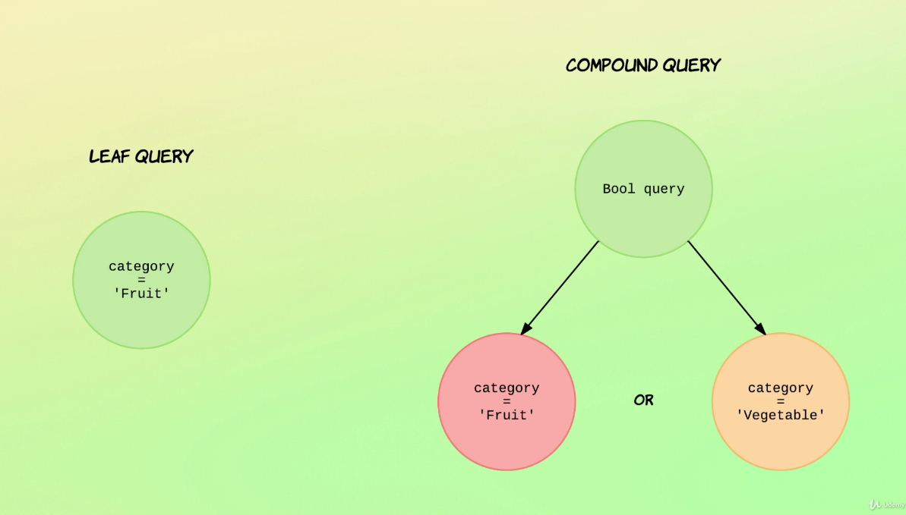
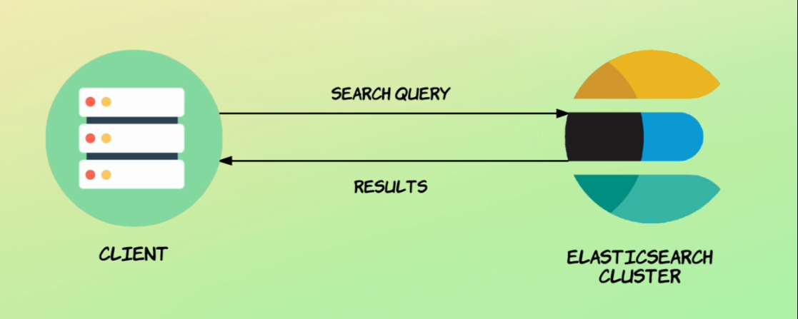
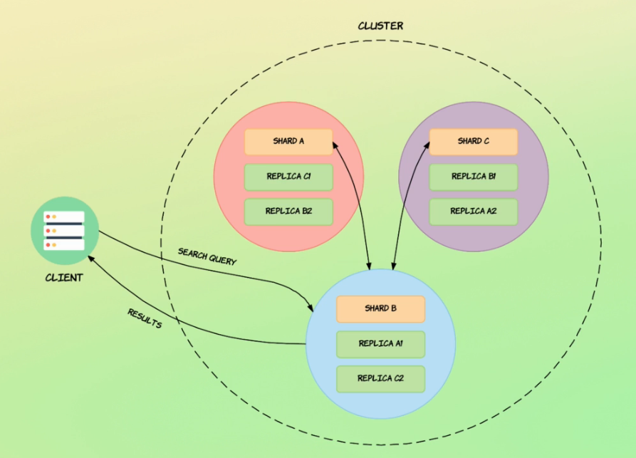
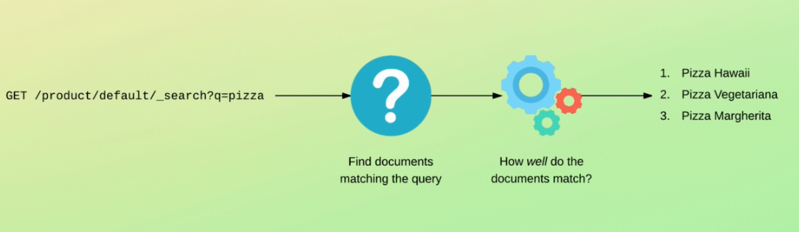
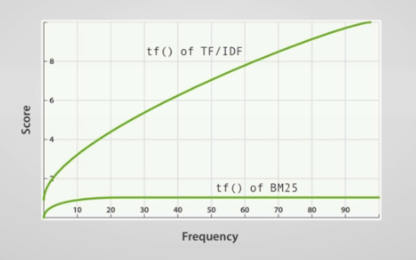
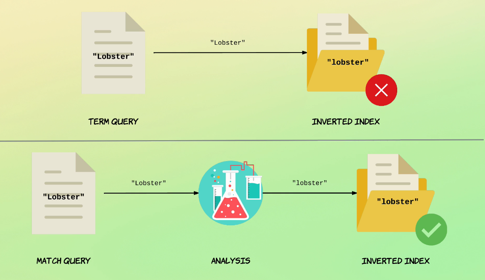

# Recherche

Il existe deux types de recherche :

- Query URI : Embarquer la requête de recherche dans l'URI. Elle est difficile à lire.
- Query DSL : Requete de recherche dans le corps de la requête. On ajoute un objet de type query qui contient la définition de la requête.

### Recherche avec une Query URI :

Matcher tous les documents :
```
GET /products/_search?q=*
```

Matcher les documents contenant un term :
```
GET /products/_search?q=name:Lobster
```

Matcher avec un opérateur logique multi-critères :
```
GET /products/_search?q=tags:Meat AND name:Tuna
```

### Recherche par Query DSL :

Il existe deux types de requêtes :
- Leaf query cherche une valeur donnée dans un champ particulier, comme les queries match, term ou range.
- Compound query se compose de plusieurs leaf ou compouned queries, comme bool.



Matcher tous les documents :
```
GET /products/_search
{
  "query": {
    "match_all": {}
  }
}
```



En regardant de plus près :  


Le noeud en bleu est le noeud de coordination. Il dirige les requêtes vers les bons noeuds, récupère les résultats, les fusionne et les renvoie vers le client.  
A noter que pour les récupérations de documents par identifiant, la requête est redirigée directement vers le shard où le document est stocké.

### Le score de pertinence :
Elasticsearch traite des requêtes de recherche en renvoyant les éléments qui répondent aux critères de la recherche. Pour chaque élément du résultat il retourne un indicateur qui dit jusqu'à quel point l'élément correspond aux critères de la recherche. Cet indicateur est le score de pertinence.  


Comment est calculé ce score ?  
Jusqu'à très récemment Elasticsearch utilisait un algoithme qui s'appelle le TF-IDF (Term Frequency / Inverse Document Frequency). Cet algoithme a été remplacé par Okapi BM25.

1. Term Frequency (TF) : Il représente le nombre de fois qu'un terme est présent dans un texte (valeur d'un champ d'un document). Plus le terme apparait plus la pertinence du document sera élevée.
2. Inverse Document Frequency (IDF) : Il représente le nombre de fois que le terme est présent dans tous les textes (les valeurs d'un champ sur tous les documents). Plus il sera présent dans un grand nombre de document moins il sera pertinent.  
**=>** TF/IDF : Si un document contient un terme et que ce terme n'est pas très courant alors le document est pertinent.

3. Field-length norm : La longueur du texte (valeur d'un champ). Plus il est court plus la pertinence augmentera. Un terme appraraissant dans un texte court aura plus de poids que dans un texte long.

Ces trois paramètres sont calculés et stockés lorsqu'un document est indexé ou modifié.

**=>** BM25 : Offre une meilleure gestion des stop words en ne boostant pas leur score malgré le fait qu'ils soient très nombreux. C'est ce qui s'appelle la Nonlinear Term Frequency Saturation.



Le BM25 améliore également la prise en compte du Field-length norm. Pour cela l'algorithme rend en compte la longueur moyenne des valeurs de chaque champs séparément. Par exemple un titre long aura plus d'incidence qu'une longue description.

Il est possible de changer la manière dont le score est calculé. Mais cela est fortement déconseillé !!

Le paramètre explain permet d'avoir des informations détaillées sur le calcul du score de pertinence :
```
GET /products/_search
{
  "explain": true,
  "query": {
    "term": {
      "name": "lobster"
    }
  }
}
```

### Query Context Vs. Filter Context :
* **Query context :** la question posée à Elasticsearch est "A quel point les documents correspondent aux critères de la recherche ?". Certes, Elasticsearch décide quel document correspond ou pas mais en plus il accompagne chaque élément d'un score de pertinence.
* **Filter context :** la question posée à Elasticsearch est "Est-ce-que les documents matchent ?". Le score de pertinence n'est pas calculé !! C'est une évaluation booléenne et est utilse pour le filtrage par date, statut ou intervalle.

### Term level queries vs Full text queries :
* **Term level :** Les termes ne sont pas analysés et la recherche fonctionne en mode correspondance exacte.
* **Full text :** Les requêtes sont analysés par l'analyzer qui a servi à indexer les documents.



Le term level queries ne sont pas appropriées pour les recherches textuelles parce que l'index inversé sera différent du contenu de la requête (au niveau de la casse, du stemming, etc.). Elles sont mieux adaptées au recherche sur les nombres, les dates, les booléens, etc.
 