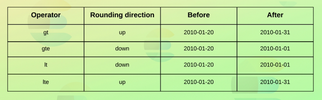

# Term Level Queries :

### Recherche par terme :
```
GET /products/_search
{
  "query": {
    "term": {
      "is_active": true
    }
  }
}
```
```
GET /products/_search
{
  "query": {
    "term": {
      "is_active": {
        "value": true
      }
    }
  }
}
```
Les deux requêtes sont équivalentes.

### Recherche par multiple termes : 
Pour cela il faut fournir un tableau de mots clés :
```
GET /products/_search
{
  "query": {
    "terms": {
      "tags.keyword": [ "Soup", "Cake" ]
    }
  }
}
```

Récupérer les documents dont les identifiants sont 1, 2 ou 3 :
```
GET /products/_search
{
  "query": {
    "ids": {
      "values": [ 1, 2, 3 ]
    }
  }
}
```

Similaire à la clause IN en SQL.

### Recherche de documents avec un intervalle de valeurs :
Pour cela il faut utiliser une requête de type range.
```
GET /products/_search
{
  "query": {
    "range": {
      "in_stock": {
        "gte": 1,
        "lte": 5
      }
    }
  }
}
```

Les intervalles peuvent concerner des dates aussi (avec ou sans format) :
```
GET /products/_search
{
  "query": {
    "range": {
      "created": {
        "gte": "01-01-2010",
        "lte": "31-12-2010",
        "format": "dd-MM-yyyy"
      }
    }
  }
}
```

### Recherche en utilisant les dates relatives :
Rechercher des documents en se basant sur une date moins un an et un jour.
```
GET /products/_search
{
  "query": {
    "range": {
      "created": {
        "gte": "2010/01/01||-1y-1d"
      }
    }
  }
}
```

Retrancher un an et arrondir au mois :
```
"gte": "2010/01/01||-1y/M"
```

Arrondir par mois avant de retrancher un an à partir du 2010/01/01 :
```
"gte": "2010/01/01||/M-1y"
```

Comment Elasticsearch arrondit par mois en fonction de l'opérateur :  


Arrondir par mois avant de retrancher un an à partir de la date courante :
```
"gte": "now/M-1y"
```

### Recherche de documents avec des valeurs non nulles :
Pour cela il faut utiliser le requête de type exists, un tableau vide est considéré comme une valeur nulle :
```
GET /products/_search
{
  "query": {
    "exists": {
      "field": "tags"
    }
  }
}
```

### Recherche basée sur les prefixes :
Pour cela il faut utiliser le requête de type prefix :
```
GET /products/_search
{
  "query": {
    "prefix": {
      "tags.keyword": "Vege"
    }
  }
}
```

### Recherche avec wildcards :
Les requêtes avec wildcard sont très gourmandes en ressources et peuvent être lentes.  
Par exemple il ne faut jamais utiliser de wildcard au début du critére de recherche.

Ajouter un asterisque pour tous les caractères (zéro ou plus) :
```
GET /products/_search
{
  "query": {
    "wildcard": {
      "tags.keyword": "Veg*ble"
    }
  }
}
```

Ajouter un point d'interrogation pour tout caractère :
```
"tags.keyword": "Veget?ble"
```

### Recherche avec expressions régulières :
Pour comprendre comment fonctionnent les expressions régulières dans Elasticsearch :  
https://www.elastic.co/guide/en/elasticsearch/reference/current/query-dsl-regexp-query.html#regexp-syntax

Rechercher les produits répondant au critère : "Veg(suite_de_caractères_alphabétiques)ble"
```
GET /products/_search
{
  "query": {
    "regexp": {
      "tags.keyword": "Veg[a-zA-Z]+ble"
    }
  }
}
```
