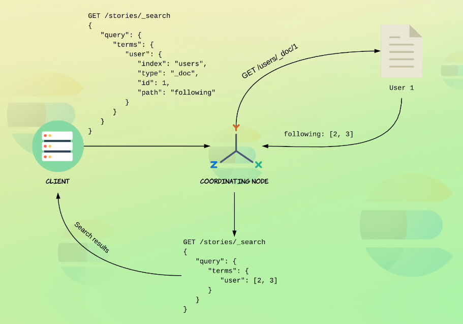

# Jointures

Dans Elasticsearch les performances des recherches sont optimisées par la dénormalisation des données.  


Elasticsearch ne supporte pas les jointures simples comme dans une base de données relationnelles.  
Mais il y a des façons de le faire différemment.  
Cependant : les jointures sont très couteuses !!

### Requête Nested :
Elles permettent de réaliser des jointures entre les données. Ce type de requêtes est utilisé pour les tableaux d'objets pour maintenir les relations entre les propriétés d'objets en mode many-to-one.  
Si un champ est mappé en tant que tableau, toutes les propriétés de l'objet seront mélangées lors du stockage par Elasticsearch.

Exemple :
```
PUT /department
{
  "mappings": {  
    "properties": {
      "name": {
        "type": "text"
      },
      "employees": {
        "type": "nested"
      }
    }
  }
}
```

##### Création du jeu de données :
https://github.com/codingexplained/complete-guide-to-elasticsearch/blob/master/Joining%20Queries/querying-nested-objects.md

Cela ne renvoie aucun résultat, les champs nested ne peuvent pas être requêtés de la sorte.
```
GET /department/_search
{
  "query": {
    "bool": {
      "must": [
        {
          "match": {
            "employees.position": "intern"
          }
        },
        {
          "term": {
            "employees.gender.keyword": {
              "value": "F"
            }
          }
        }
      ]
    }
}
```

Pour cela il faut utiliser la requête de type nested, cette requête contient deux parties :

- path : le chemin vers le champs contenant les objets.
- query : la requête qui sera exécutée sur ces objets.
```
GET /department/_search
{
  "query": {
    "nested": {
      "path": "employees",
      "inner_hits": {},
      "query": {
        "bool": {
          "must": [
            {
              "match": {
                "employees.position": "intern"
              }
            },
            {
              "term": {
                "employees.gender.keyword": {
                  "value": "F"
                }
              }
            }
          ]
        }
      }
    }
  }
}
```

Les deux départements sont remontés car les liens sont maintenus.  
La clause `inner_hits` combinée à `_source` à false, permet de ne récupérer que les employés qui répondent aux critères de la recherche dans l'élement inner_hits de la réponse.

Cela aurait-il pu être possible avec le type array ? Non car l'association entre les objets seraient perdue.  


Nested permet de requêter chaque objet de manière indépendante. Dans cette approche chaque employé est stocké dans un document département. Cela rend complexe les opérations de mise à jour.  
Ne serait-il pas mieux si chaque document était un document en soi, et qu'il y ait une façon de relier les employés aux départements.


Pour cela il faut utiliser le concept de champ de type join.

### Mapping de liens entre documents :
Utiliser les champs de type join. Ces champs définissent les relations entre les documents qui font partie d'une hiérarchie de documents (parent <-> enfants).
```
PUT /department
{
  "mappings": {
    "properties": {
      "join_field": { 
        "type": "join",
        "relations": {
          "department": "employee"
        }
      }
    }
  }
}
```

Ici, dans la relation décrite department est le parent de employee.  
Il est possible de définir plusieurs enfants dans la relation : 
```
	"department": ["employee", "computer", etc...]
```

##### Ajout d'un parent :

Dans le champ `join_field` on définit quelle relation cela représente dans le mapping.
```
PUT /department/_doc/1
{
  "name": "Development",
  "join_field": {
    "name" : "department"
  }
}
```
(See screenshot dans MD)

##### Ajout d'un enfant :
Dans le champ parent de `join_field` spécifier l'identifiant du parent.  
A noter que le paramètre routing est obligatoire pour que les parents et enfants soient stockés dans le même shard. Pour cela on utilise l'identifiant du parent comme valeur de routage.
```
PUT /department/_doc/3?routing=1
{
  "name": "Mo Andersen",
  "age": 28,
  "gender": "M",
  "join_field": {
    "name": "employee",
    "parent": 1
  }
}
```

### Recherche des enfants en se basant sur l'identifiant du parent :
Il faut utiliser la requête `parent_id` pour laquelle on définit la relation à requêter (le type de document à retourner) et l'identifaint du parent.
```
GET /department/_search
{
  "query": {
    "parent_id": {
      "type": "employee",
      "id": 1
    }
  }
}
```

### Recherche des enfants par parent :
Pour ce faire, utiliser la requête `has_parent` où doivent être définis le type du parent et les critères de recherche auxquels le parent doit répondre.
```
GET /department/_search
{
  "query": {
    "has_parent": {
      "parent_type": "department",
      "query": {
        "term": {
          "name.keyword": "Development"
        }
      }
    }
  }
}
```

Incorporer le score de pertinence des documents trouvés :  
Par défaut, la requête ignore le score de pertinence, c'est à dire que la correspondance du parent aux critères de recherches n'a aucune incidence sur le calcul du score.  
Il est cependant possible d'y remédier grâce à l'option score. Ainsi les enfants qui appartiennent au parent correspondant le mieux aux critères de la requête auront le score le plus élevé.
```
GET /department/_search
{
  "query": {
    "has_parent": {
      "parent_type": "department",
      "score": true,
      "query": {
        "term": {
          "name.keyword": "Development"
        }
      }
    }
  }
}
```

### Recherche de parents par critères sur enfants :
Recherche de parents avec enfants qui répondent à une requête de type bool.
Pour ce faire, utiliser la clause has_child où doivent figurer le type des enfants et les critères de recherche sur ces enfants.
```
GET /department/_search
{
  "query": {
    "has_child": {
      "type": "employee",
      "query": {
        "bool": {
          "must": [
            {
              "range": {
                "age": {
                  "gte": 30
                }
              }
            }
          ],
          "should": [
            {
              "term": {
                "gender.keyword": "M"
              }
            }
          ]
        }
      }
    }
  }
}
```

Prendre en compte le score de pertinence avec le `score_mode` :
```
GET /department/_search
{
  "query": {
    "has_child": {
      "type": "employee",
      "score_mode": "sum",
      "query": {
        "bool": {
          "must": [
            {
              "range": {
                "age": {
                  "gte": 50
                }
              }
            }
          ],
          "should": [
            {
              "term": {
                "gender.keyword": "M"
              }
            }
          ]
        }
      }
    }
  }
}
```

Il existe plusieurs modes de calcul de score pour les requêtes `has_child` :  


Spécifier le nombre minimum et maximum d'enfants :
```
GET /department/_search
{
  "query": {
    "has_child": {
      "type": "employee",
      "score_mode": "sum",
      "min_children": 2,
      "max_children": 5,
      "query": {
        "bool": {
          "must": [
            {
              "range": {
                "age": {
                  "gte": 50
                }
              }
            }
          ],
          "should": [
            {
              "term": {
                "gender.keyword": "M"
              }
            }
          ]
        }
      }
    }
  }
}
```

### Relations Multi-niveaux :


Création d'un index avec mapping :  
Définir le type de la relation company qui contient les relations en tant que parent de department et supply.  
Définir également la relation entre department et employee.
```
PUT /company
{
  "mappings": {
    "properties": {
      "join_field": { 
        "type": "join",
        "relations": {
          "company": ["department", "supplier"],
          "department": "employee"
        }
      }
    }
  }
}
```

Ajouter les élements de la hiérarchie :
```
PUT /company/_doc/1
{
  "name": "My Company Inc.",
  "join_field": {
  	"name": "company"
  }
}

PUT /company/_doc/2?routing=1
{
  "name": "Development",
  "join_field": {
    "name": "department",
    "parent": 1
  }
}

PUT /company/_doc/3?routing=1
{
  "name": "Bo Andersen",
  "join_field": {
    "name": "employee",
    "parent": 2
  }
}
```

##### Création du jeu de données complet :

https://github.com/mehdi-lamrani/elasticsearch-workshop/blob/solutions/09.%20Joining%20Queries/09.%20Joining%20Queries.md

Exemple de requête multi-niveaux : rechercher l'entreprise ayant un département où travaille un certain "John Doe".
```
GET /company/_search
{
  "query": {
    "has_child": {
      "type": "department",
      "query": {
        "has_child": {
          "type": "employee",
          "query": {
            "term": {
              "name.keyword": "John Doe"
            }
          }
        }
      }
    }
  }
}
```

### Parent/enfant inner hits :
Inclure les inner hits pour les requêtes `has_child` permet de voir aussi les enfants qui répondent aux critères de la requête `has_child` :
```
GET /department/_search
{
  "query": {
    "has_child": {
      "type": "employee",
      "inner_hits": {},
      "query": {
        "bool": {
          "must": [
            {
              "range": {
                "age": {
                  "gte": 50
                }
              }
            }
          ],
          "should": [
            {
              "term": {
                "gender.keyword": "M"
              }
            }
          ]
        }
      }
    }
  }
}
```

Inclure les inner hits pour les requêtes `has_parent` :
```
GET /department/_search
{
  "query": {
    "has_parent": {
      "inner_hits": {},
      "parent_type": "department",
      "query": {
        "term": {
          "name.keyword": "Development"
        }
      }
    }
  }
}
```

### Terms lookup :
Le terms lookup permet de retrouver des termes à partir d'un index, d'un champ en spécifiant les critères nécessaires comme l'identifiant du document.

Création du jeu de données complet :

https://github.com/mehdi-lamrani/elasticsearch-workshop/blob/solutions/09.%20Joining%20Queries/09.%20Joining%20Queries.md

Rechercher les stories des utilsateur suivis par l'utilisateur dont l'identifant est 1 :
```
GET /stories/_search
{
  "query": {
    "terms": {
      "user": {
        "index": "users",
        "id": "1",
        "path": "following"
      }
    }
  }
}
```

Comme le user 1 suit les users 2 et 3, la requête ci-dessus équivaut à :
```
{
  "query": {
    "terms": {
      "user": [2, 3]
    }
  }
}
```



## Les contraintes et limitations :

* Dans une jointure les documents doivent provenir du même index, pour des raisons de performance.
* Parents et enfants doivent appartenir au même shard.
* Un seul champ de type join par index. Il peut avoir plusieurs relations.
* De nouvelles relations peuvent être créées après la création de l'index.
* Des relations enfant peuvent être rajoutées à un parent existant.
* Un document peut avoir un seul parent.

## Performances :

* Les jointures sont gourmandes et lentes, elles doivent être évitées si possible.
* Plus il y a de documents pointant sur des parents unique, plus la requête has_child sera lente.
* Il en va de même pour la requête has_parent.
* Chaque niveau en plus dans la hiérarchie rajoute de la lenteur.

Il n'est pas déconseillé de les utiliser pour des index avec pas beaucoup de documents ou le cas où les parents auraient beaucoup d'enfants (recette -> ingrédients).<br/>  
Mais en régle générale il vaut mieux éviter, Elasticsearch est fait pour de la recherche est n'est un SGBDR. Dans Elasticsearch il est recommandé de dénormaliser les données pour améliorer les performances de recherche.
