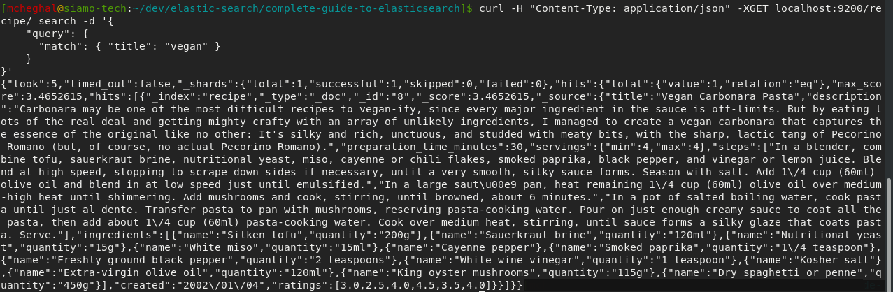

# Controller les résultats de requêtes

### Spécifier le format du résultat :

Retourner les résultats en YAML :
```
GET /recipe?format=yaml
```

Retourner les résultats en JSON formatté :
```
GET /recipe/_search?pretty
{
    "query": {
      "match": { "title": "vegan" }
    }
}
```

Sous Kibana le résultat est mis en forme par défaut, par contre en ligne de commande avec cURL l'utilisation du paramètre pretty n'est pas superflu.  
Résulat sans le paramètre pretty en ligne de commande :  


### Spécifier la taille du résultat :

En utilisant un paramètre de la requête :
```
GET /recipe/_search?size=2
{
  "_source": false,
  "query": {
    "match": {
      "title": "pasta"
    }
  }
}
```

Même si le nombre de résultat répondant à la recherche est de 9, seuls les 2 éléments ayant le plus haut score de pertinance sont affichés.

En utilisant le paramètre dans le corps de la requête :
```
GET /recipe/_search
{
  "_source": false,
  "size": 2,
  "query": {
    "match": {
      "title": "pasta"
    }
  }
}
```

### Filtrage de la Source :
Par défaut tout le contenu est retourné. Il est possible de réduire la quantité d'information retournée dans source par soucis de clarté et de réduction du flux sur le réseau, spécialement quand le résultat est très volumineux et avec beaucoup de textes longs.

Exclure complétement le champ _source :  
Cela peut être pertinent quand les seules informations ciblées sont les identifiants des documents.
```
GET /recipe/_search
{
  "_source": false,
  "query": {
    "match": { "title": "vegan" }
  }
}
```

Retourner un champ spécifique uniquement :  
La même recherche que la présédente mais uniquement le champ created.
```
GET /recipe/_search
{
  "_source": "created",
  "query": {
    "match": { "title": "vegan" }
  }
}
```

Retourner un ensemble de clés spécifiques d'un objet :
```
GET /recipe/_search
{
  "_source": ["ingredients.name", "title"]
  "query": {
    "match": { "title": "cheese" }
  }
}
```

Retourner toutes les clés d'un objet :
```
GET /recipe/_search
{
  "_source": "ingredients.*",
  "query": {
    "match": { "title": "cheese" }
  }
}
```

Inclure/Exclure les clés d'un objet :
```
GET /recipe/_search
{
  "_source": {
    "includes": [ "ingredients.*", "title"],
    "excludes": "ingredients.name"
  },
  "query": {
    "match": { "title": "cheese" }
  }
}
```

### Spécifier un offset :
Avec le paramètre from :
```
GET /recipe/_search
{
  "_source": false,
  "size": 2,
  "from": 2,
  "query": {
    "match": {
      "title": "pasta"
    }
  }
}
```

### Tri des résultats :
Tri ascendant (implicite) :
```
GET /recipe/_search
{
  "_source": false,
  "query": {
    "match_all": {}
  },
  "sort": [
    "preparation_time_minutes"
  ]
}
```

Tri descendant (explicite) :
```
GET /recipe/_search
{
  "_source": "created",
  "query": {
    "match_all": {}
  },
  "sort": [
    { "created": "desc" }
  ]
}
```

L'élément created affiché dans le sort n'est pas la date formattée mais la représentation sous forme de nombre de millisecondes depuis le 1er Janvier 1970.

Tri par multiple champs :
```
GET /recipe/_search
{
  "_source": [ "preparation_time_minutes", "created" ],
  "query": {
    "match_all": {}
  },
  "sort": [
    { "preparation_time_minutes": "asc" },
    { "created": "desc" }
  ]
}
```

### Tri par multi-valeurs :

Trier les recettes par moyenne de ratings (descendant) :
```
GET /recipe/_search
{
  "_source": "ratings",
  "query": {
    "match_all": {}
  },
  "sort": [
    {
      "ratings": {
        "order": "desc",
        "mode": "avg"
      }
    }
  ]
}
```

Dans le résultat de la requête l'élément sort contient la moyenne des ratings, qui est le critère de tri.