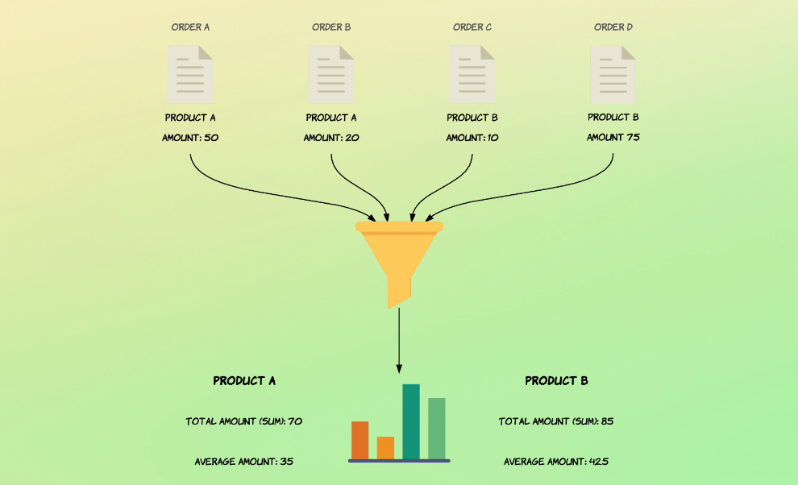
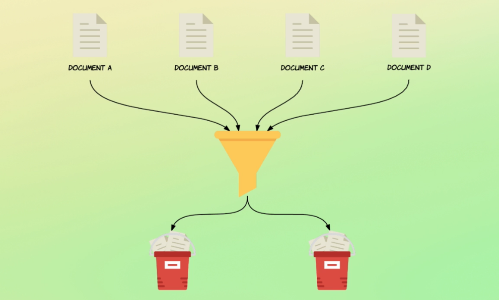
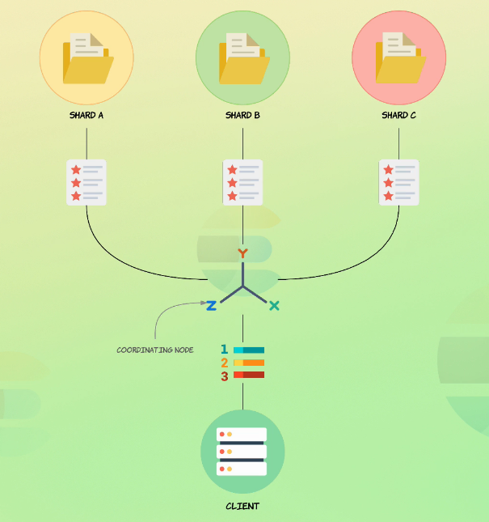
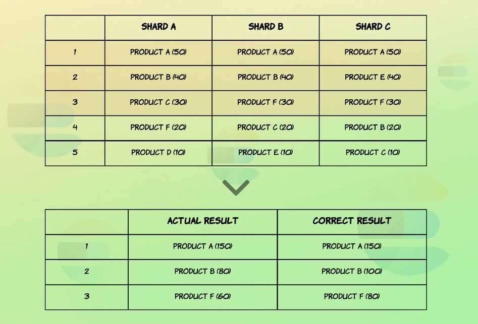
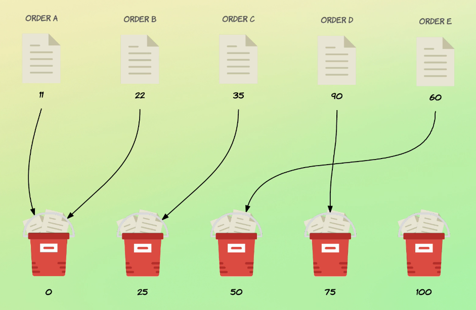

# Aggrégations

Les aggrégations sont la manière de regrouper et d'extraire des statistiques à partir des données. Les aggrégations travaillent avec un ensemble de documents qui sont définis dans un contexte d'exécution.

Ci-dessous des exemples d'aggrégations sur un ensemble de documents (products) :  


### Aggrégations de métriques :

Calcul de statistiques avec les aggrégations sum, avg, min, et max :
```
GET /order/_search
{
  "size": 0,
  "aggs": {
    "total_sales": {
      "sum": {
        "field": "total_amount"
      }
    },
    "avg_sale": {
      "avg": {
        "field": "total_amount"
      }
    },
    "min_sale": {
      "min": {
        "field": "total_amount"
      }
    },
    "max_sale": {
      "max": {
        "field": "total_amount"
      }
    }
  }
}
```

Retrouver le nombre de valeurs distinctes, par défaut le résultat est approximatif car la requête exige trop de ressources au cluster :
```
GET /order/_search
{
  "size": 0,
  "aggs": {
    "total_salesmen": {
      "cardinality": {
        "field": "salesman.id"
      }
    }
  }
}
```

Retrouver le nombre de valeurs :
```
GET /order/_search
{
  "size": 0,
  "aggs": {
    "values_count": {
      "value_count": {
        "field": "total_amount"
      }
    }
  }
}
```

Utiliser l'aggrégation stats pour les calculs communs de statistiques :
```
GET /order/_search
{
  "size": 0,
  "aggs": {
    "amount_stats": {
      "stats": {
        "field": "total_amount"
      }
    }
  }
}
```

### Aggregations de buckets :
Au lieu de calculer des metriques sur des champs, les aggrégations de buckets créent des buckets de documents. Chaque bucket possède des critères qui determinent si un document ira ou non dans ce bucket.  


Référence :  
https://www.elastic.co/guide/en/elasticsearch/reference/current/search-aggregations-bucket-terms-aggregation.html

Creation d'un bucket pour chaque valeur de status :
```
GET /order/_search
{
  "size": 0,
  "aggs": {
    "status_terms": {
      "terms": {
        "field": "status"
      }
    }
  }
}
```

Aggrégation de documents avec valeurs manquantes (ou NULL), les documents avec status à NULL seront placés dans un bucket "N/A" :
```
GET /order/_search
{
  "size": 0,
  "aggs": {
    "status_terms": {
      "terms": {
        "field": "status",
        "size": 20,
        "missing": "N/A"
      }
    }
  }
}
```

Changer le nombre minimum de documents pour qu'un bucket soit créé et apparaisse dans les résultats :
```
GET /order/_search
{
  "size": 0,
  "aggs": {
    "status_terms": {
      "terms": {
        "field": "status",
        "size": 20,
        "missing": "N/A",
        "min_doc_count": 0
      }
    }
  }
}
```

Trier les buckets :
```
GET /order/_search
{
  "size": 0,
  "aggs": {
    "status_terms": {
      "terms": {
        "field": "status",
        "size": 20,
        "missing": "N/A",
        "min_doc_count": 0,
        "order": {
          "_key": "asc"
        }
      }
    }
  }
}
```

### Le "Document count" est approximatif :
La raison pour laquelle le comptage des documents est approximatif est lié à la nature distribuée d'Elasticsearch. Spécifiquement le fait que les index sont distribués à travers multiples shards. La manière dont les aggrègations fonctionnent est que le noeud de coordination est responsable de la recherche de termes dans les shards. Si le but est d'obtenir trois termes il demande à chaque shard de lui fournir les trois termes les plus pertinents. Le noeud de coordination récupère le résultat de chaque noeud et calcule le résultat final. C'est durant cette étape que le calcul du count peut devenir imprécis.





Dans l'exemple ci-dessus le calcul pour les produits B et F ne seront pas bons.  
Pour pallier au maximum ce problème il faut augmenter le paramètre size de la requête (10 par défaut), ce qui aura un cout sur le temps de traitement.   
Entre précision et temps de traitement, il faudra choisir.

Le champ doc_count_error_upper_bound contient le maximum possible de documents n'ayant pas été pris en compte pour un terme dans le résultat final. Dans l'exemple ci-dessus Elasticsearch va calculer la somme des éléments en dernier parmi les éléments retournés (90 donc). Cela veut dire que dans le pire des cas 90 documents ont été ignorés.

### Les aggrégations imbriquées :

Retrouver les statistiques pour chaque status :
```
GET /order/_search
{
  "size": 0,
  "aggs": {
    "status_terms": {
      "terms": {
        "field": "status"
      },
      "aggs": {
        "status_stats": {
          "stats": {
            "field": "total_amount"
          }
        }
      }
    }
  }
}
```

Affiner le contexte d'agrégation :
```
GET /order/_search
{
  "size": 0,
  "query": {
    "range": {
      "total_amount": {
        "gte": 100
      }
    }
  },
  "aggs": {
    "status_terms": {
      "terms": {
        "field": "status"
      },
      "aggs": {
        "status_stats": {
          "stats": {
            "field": "total_amount"
          }
        }
      }
    }
  }
}
```

Les aggrégations de buckets peuvent contenir d'autres aggrégations de buckets ou de metriques. Par contre les aggrégations de metriques ne peuvent pas contenir d'aggrégations, on peut les comparer aux Leaf queries en opposition aux compouned queries.  
Chaque aggrégation est exécutée dans le contexte de la query ou l'aggrégation dans laquelle elle est déclarée.

### Filtrer des documents :

Filtrer des documents avec un total_amount faible, cela donne le nombre de documents ayant un total_amount inférieur à 50 :
```
GET /order/_search
{
  "size": 0,
  "aggs": {
    "low_value": {
      "filter": {
        "range": {
          "total_amount": {
            "lt": 50
          }
        }
      }
    }
  }
}
```

Aggrégation de buckets avec les documents restants :
```
GET /order/_search
{
  "size": 0,
  "aggs": {
    "low_value": {
      "filter": {
        "range": {
          "total_amount": {
            "lt": 50
          }
        }
      },
      "aggs": {
        "avg_amount": {
          "avg": {
            "field": "total_amount"
          }
        }
      }
    }
  }
}
```

L'aggrégation avg est exécutée dans le contexte du filter, elle n'aggrége que les documents qui matchent la requête range.

### Definition de règles de buckets avec filtres :

Placer des documents dans des buckets selon critères :
```
GET /recipe/_search
{
  "size": 0,
  "aggs": {
    "my_filter": {
      "filters": {
        "filters": {
          "pasta": {
            "match": {
              "title": "pasta"
            }
          },
          "spaghetti": {
            "match": {
              "title": "spaghetti"
            }
          }
        }
      }
    }
  }
}
```

On peut rajouter des aggrégations :
```
GET /recipe/_search
{
  "size": 0,
  "aggs": {
    "my_filter": {
      "filters": {
        "filters": {
          "pasta": {
            "match": {
              "title": "pasta"
            }
          },
          "spaghetti": {
            "match": {
              "title": "spaghetti"
            }
          }
        }
        
      },
      "aggs": {
        "avg_preparation_time": {
          "avg": {
            "field": "preparation_time_minutes"
          }
        },
        "avg_ratings": {
          "avg": {
            "field": "ratings"
          }
        }
      }
    }
  }
}
```

### Aggrégations par plages :

Aggrégation range :
```
GET /order/_search
{
  "size": 0,
  "aggs": {
    "amount_distribution": {
      "range": {
        "field": "total_amount",
        "ranges": [
          {
            "to": 50
          },
          {
            "from": 50,
            "to": 100
          },
          {
            "from": 100
          }
        ]
      }
    }
  }
}
```

Aggrégation date_range :
```
GET /order/_search
{
  "size": 0,
  "aggs": {
    "purchased_ranges": {
      "date_range": {
        "field": "purchased_at",
        "ranges": [
          {
            "from": "2016-01-01",
            "to": "2016-01-01||+6M"
          },
          {
            "from": "2016-01-01||+6M",
            "to": "2016-01-01||+1y"
          }
        ]
      }
    }
  }
}
```

Dans le résultat la valeur du "to" sera le 2016-07-01 au lieu 2016-06-30 pour la première plage. Ce n'est pas une erreur, le "to" est exclu.

Spécifier le format de date :
```
GET /order/_search
{
  "size": 0,
  "aggs": {
    "purchased_ranges": {
      "date_range": {
        "field": "purchased_at",
        "format": "yyyy-MM-dd",
        "ranges": [
          {
            "from": "2016-01-01",
            "to": "2016-01-01||+6M"
          },
          {
            "from": "2016-01-01||+6M",
            "to": "2016-01-01||+1y"
          }
        ]
      }
    }
  }
}
```

Activer les clés de buckets :
```
GET /order/_search
{
  "size": 0,
  "aggs": {
    "purchased_ranges": {
      "date_range": {
        "field": "purchased_at",
        "format": "yyyy-MM-dd",
        "keyed": true,
        "ranges": [
          {
            "from": "2016-01-01",
            "to": "2016-01-01||+6M"
          },
          {
            "from": "2016-01-01||+6M",
            "to": "2016-01-01||+1y"
          }
        ]
      }
    }
  }
}
```

Définir les clés de buckets :
```
GET /order/_search
{
  "size": 0,
  "aggs": {
    "purchased_ranges": {
      "date_range": {
        "field": "purchased_at",
        "format": "yyyy-MM-dd",
        "keyed": true,
        "ranges": [
          {
            "from": "2016-01-01",
            "to": "2016-01-01||+6M",
            "key": "first_half"
          },
          {
            "from": "2016-01-01||+6M",
            "to": "2016-01-01||+1y",
            "key": "second_half"
          }
        ]
      }
    }
  }
}
```

Ajouter une sous-aggrégation :
```
GET /order/_search
{
  "size": 0,
  "aggs": {
    "purchased_ranges": {
      "date_range": {
        "field": "purchased_at",
        "format": "yyyy-MM-dd",
        "keyed": true,
        "ranges": [
          {
            "from": "2016-01-01",
            "to": "2016-01-01||+6M",
            "key": "first_half"
          },
          {
            "from": "2016-01-01||+6M",
            "to": "2016-01-01||+1y",
            "key": "second_half"
          }
        ]
      },
      "aggs": {
        "bucket_stats": {
          "stats": {
            "field": "total_amount"
          }
        }
      }
    }
  }
}
```

### Histogrammes :

Un histogramme construit dynamiquement des buckets à partir de valeurs numériques en se basant sur un intervalle défini.


Distribution des valeurs du champ total_amount avec un intervalle de 25 :
```
GET /order/_search
{
  "size": 0,
  "aggs": {
    "amount_distribution": {
      "histogram": {
        "field": "total_amount",
        "interval": 25
      }
    }
  }
}
```

Requérir un minimum de documents par bucket :
```
GET /order/_search
{
  "size": 0,
  "aggs": {
    "amount_distribution": {
      "histogram": {
        "field": "total_amount",
        "interval": 25,
        "min_doc_count": 1
      }
    }
  }
}
```

Spécifier des limites fixes pour les buckets :
```
GET /order/_search
{
  "size": 0,
  "query": {
    "range": {
      "total_amount": {
        "gte": 100
      }
    }
  },
  "aggs": {
    "amount_distribution": {
      "histogram": {
        "field": "total_amount",
        "interval": 25,
        "min_doc_count": 0,
        "extended_bounds": {
          "min": 0,
          "max": 500
        }
      }
    }
  }
}
```

Aggrégation par mois avec l'aggrégation date_histogram :
```
GET /order/_search
{
  "size": 0,
  "aggs": {
    "orders_over_time": {
      "date_histogram": {
        "field": "purchased_at",
        "interval": "month"
      }
    }
  }
}
```

### Aggregation global :

Sortir du contexte de l'aggrégation :
```
GET /order/_search
{
  "query": {
    "range": {
      "total_amount": {
        "gte": 100
      }
    }
  },
  "size": 0,
  "aggs": {
    "all_orders": {
      "global": { },
      "aggs": {
        "stats_amount": {
          "stats": {
            "field": "total_amount"
          }
        }
      }
    }
  }
}
```

Ajouter aggrégation sans contexte global :
```
GET /order/_search
{
  "query": {
    "range": {
      "total_amount": {
        "gte": 100
      }
    }
  },
  "size": 0,
  "aggs": {
    "all_orders": {
      "global": { },
      "aggs": {
        "stats_amount": {
          "stats": {
            "field": "total_amount"
          }
        }
      }
    },
    "stats_expensive": {
      "stats": {
        "field": "total_amount"
      }
    }
  }
}
```

### Valeurs de champs manquantes :

Aggrégations de documents avec champs sans valeurs :
```
GET /order/_search
{
  "size": 0,
  "aggs": {
    "orders_without_status": {
      "missing": {
        "field": "status"
      }
    }
  }
}
```

Combiner aggrégation missing avec d'autres aggrégations :
```
GET /order/_search
{
  "size": 0,
  "aggs": {
    "orders_without_status": {
      "missing": {
        "field": "status"
      },
      "aggs": {
        "missing_sum": {
          "sum": {
            "field": "total_amount"
          }
        }
      }
    }
  }
}
```

### Aggrégation d'objets imbriqués :
Les employés sont les enfants des documents départements.
```
GET /department/_search
{
  "size": 0,
  "aggs": {
    "employees": {
      "nested": {
        "path": "employees"
      },
      "aggs": {
        "minimum_age": {
          "min": {
            "field": "employees.age"
          }
        }
      }
    }
  }
}
```
