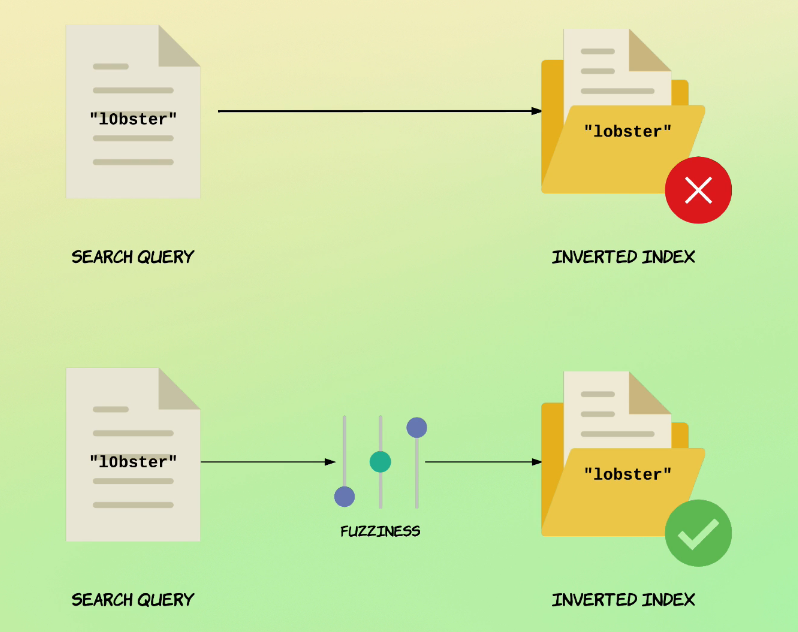
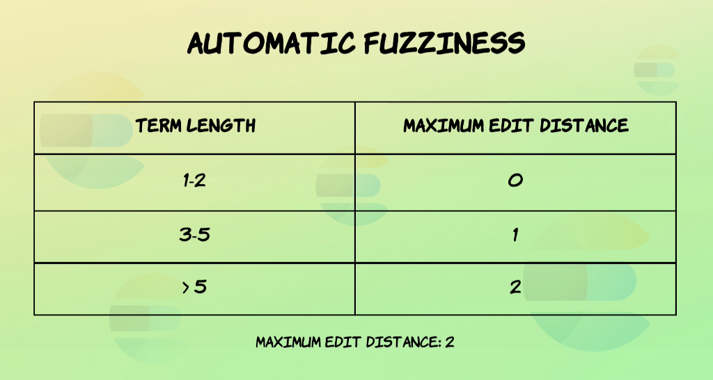

# Recherche avancée

### Recherche par proximité :

Ajouter le paramètre slop à la requête match_phrase :  
La paramètre slop permet d'accepter un nombre défini de décalages de mots dans le  match_phrase.
```
GET /proximity/_search
{
  "query": {
    "match_phrase": {
      "title": {
        "query": "spicy sauce",
        "slop": 1
      }
    }
  }
}
```

### Score de pertinence et proximité :
La proximité affecte le score de pertinence. Plus la proximité est grande plus le score sera élevé.

Booster la pertinence en se basant sur le proximité, le should est optionnel mais il booste le score :
```
GET /proximity/_search
{
  "query": {
    "bool": {
      "must": [
        {
          "match": {
            "title": {
              "query": "spicy sauce"
            }
          }
        }
      ],
      "should": [
        {
          "match_phrase": {
            "title": {
              "query": "spicy sauce"
              // "slop": 5
            }
          }
        }
      ]
    }
  }
}
```

### Requête Fuzzy match :

Le fuzziness permet de remédier au erreurs de frappes en mettant en place une tolérance dans l'analyse des mots clés de recherche.  
Fuziness est implémenté par le calcul de la distance de Levenshtein. La distance de Levenshtein est une distance, au sens mathématique du terme, donnant une mesure de la différence entre deux chaînes de caractères.  
La différence peut concerner un mauvais caractère, un caractère en moins ou un caractère en plus.  


Mode Fuzziness en auto :  


La distance maximum en automatique est de 2 :

- Les études ont montré que 80% des erreurs de frappes peuvent être corrigées avec distance d'édition de 1.
- Une valeur de Fuzziness supérieure à 2 réduit drastiquement les performances.

Recherche avec fuzziness à auto :
```
GET /product/_search
{
  "query": {
    "match": {
      "name": {
        "query": "l0bster",
        "fuzziness": "auto"
      }
    }
  }
}
```
```
GET /product/_search
{
  "query": {
    "match": {
      "name": {
        "query": "lobster",
        "fuzziness": "auto"
      }
    }
  }
}
```

Fuzziness pour term (en specifiant un entier) :
```
GET /product/_search
{
  "query": {
    "match": {
      "name": {
        "query": "l0bster love",
        "operator": "and",
        "fuzziness": 1
      }
    }
  }
}
```

Commutation de lettres avec transpositions :
```
GET /product/_search
{
  "query": {
    "match": {
      "name": {
        "query": "lvie",
        "fuzziness": 1
      }
    }
  }
}
```

Désactiver les transpositions :
```
GET /product/_search
{
  "query": {
    "match": {
      "name": {
        "query": "lvie",
        "fuzziness": 1,
        "fuzzy_transpositions": false
      }
    }
  }
}
```

### Requête fuzzy :
Comme les requêtes de type term, les requêtes fuzzy ne sont pas analysées. Mais à part cet aspect, elle fonctionne comme une requête match.
```
GET /product/_search
{
  "query": {
    "fuzzy": {
      "name": {
        "value": "LOBSTER",
        "fuzziness": "auto"
      }
    }
  }
}
```

```
GET /product/_search
{
  "query": {
    "fuzzy": {
      "name": {
        "value": "lobster",
        "fuzziness": "auto"
      }
    }
  }
}
```

### Highlight des correspondances dans les champs :

Highlight des correspondances dans le champs `description` :
```
GET /highlighting/_search
{
  "_source": false,
  "query": {
    "match": { "description": "Elasticsearch story" }
  },
  "highlight": {
    "fields": {
      "description" : {}
    }
  }
}
```

Spécifier un tag :
```
GET /highlighting/_search
{
  "_source": false,
  "query": {
    "match": { "description": "Elasticsearch story" }
  },
  "highlight": {
    "pre_tags": [ "<strong>" ],
    "post_tags": [ "</strong>" ],
    "fields": {
      "description" : {}
    }
  }
}
```
